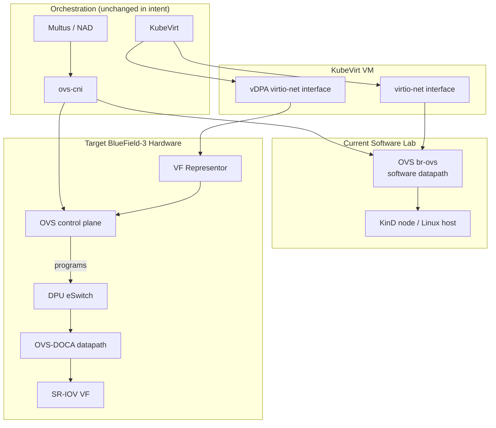

# From Software-Only OVS to BlueField-3 Hardware Offload: A Conceptual Migration

## Overview

This document describes a conceptual migration from the software OVS datapath I validated in a local lab to a hardware-offloaded architecture on NVIDIA BlueField-3. The lab proved that the logical datapath works: a KubeVirt VM attaches to an OVS-backed secondary network, receives an IP from whereabouts, exchanges traffic, and produces visible OVS flows. This document assumes that `ping_results.txt` and `verification_flows.json` have already confirmed basic reachability and flow presence on `br-ovs` in the software lab. It maps that validated path to the hardware-offloaded target without claiming the hardware offload was implemented in the lab.

## Current Software Datapath

The local lab used a KinD cluster on a single Linux host. The stack was:

- **KinD** for the Kubernetes control plane and worker node.
- **KubeVirt** to run a CirrOS VM.
- **Multus** to attach a secondary network interface to the VM.
- **ovs-cni** to connect that secondary interface to an OVS bridge.
- **whereabouts** for IPAM on the secondary network.
- A manually created OVS bridge named `br-ovs` inside the KinD node container.

The VM declared two networks: a default pod network via masquerade and a secondary `ovs-net` via Multus and `bridge` binding. The `NetworkAttachmentDefinition` used `ovs-cni` with `bridge: br-ovs` and whereabouts IPAM on `192.168.100.0/24`.

Traffic from the VM egressed through the virtio-net interface, reached the OVS bridge through the `ovs-cni` attachment, and was forwarded by the software OVS datapath running in the KinD node. A ping test confirmed reachability and `ovs-ofctl dump-flows br-ovs` showed the bridge forwarding traffic with a NORMAL action.

## Target BlueField-3 Offload Architecture

In the target architecture, the control-plane orchestration stays conceptually the same: Kubernetes, KubeVirt, Multus, and `ovs-cni` still decide which VM gets which network and which bridge it belongs to. What changes is where the packet forwarding is executed.

The NVIDIA BlueField-3 DPU is an infrastructure processor with an embedded switch. In **switchdev** mode, the embedded switch is programmable by Linux and OVS, not hidden behind a vendor-specific driver model. The host sees **SR-IOV Virtual Functions (VFs)** and their **representors**: netdevices that correspond to hardware-backed VF ports. OVS can attach representors to a bridge and program forwarding rules for them, just as for veth or tap ports.

**vDPA** (virtio Data Path Acceleration) provides an accelerated virtio-compatible datapath to the VM. From the VM’s perspective, the interface is still virtio, which means no guest OS changes are required. On the host side, vDPA terminates the virtio ring into the DPU hardware rather than into a software tap device, so the packet path bypasses the host CPU.

**OVS-DOCA** is the mechanism that allows OVS to offload its datapath pipeline into the BlueField-3 hardware. OVS remains the control plane: it still owns the bridge, ports, and flow rules. The actual packet classification, matching, and forwarding are executed by the DPU’s eSwitch or accelerated pipeline, not by `ovs-vswitchd` on the host.

## Architectural Shift

| Aspect | Current Software Lab | BlueField-3 Offloaded Design |
|---|---|---|
| Packet forwarding location | Host Linux kernel, OVS `vswitchd` datapath | DPU eSwitch / OVS-DOCA hardware pipeline |
| OVS role | Control plane + software data plane | Control plane + policy; datapath offloaded |
| VM attachment method | Multus + `ovs-cni` to `br-ovs` via tap/virtio | Multus + `ovs-cni` to representor-based bridge via vDPA |
| CPU utilization | Host CPU classifies and forwards every packet | Host CPU removed from fast path; DPU handles forwarding |
| Isolation boundary | Linux network namespace / OVS bridge | Hardware-isolated SR-IOV VF + DPU domain |
| Flow visibility | `ovs-ofctl dump-flows` on host OVS bridge | `ovs-ofctl dump-flows` via DPU / host representor view |
| Failure/debug surface | Host OVS logs, pod network status, VM interface state | DPU firmware state, representor state, hardware flow counters |

The orchestration relationship stays the same: KubeVirt creates the VM, Multus selects the secondary network, and `ovs-cni` binds it to a bridge. What moves is the physical execution: traffic previously forwarded by host software OVS is now eligible for the BlueField-3 hardware pipeline.

The control-plane and data-plane responsibilities split cleanly. KubeVirt, Multus, and `ovs-cni` continue to decide *which* VM is on *which* network. OVS continues to decide *what* the policy is. The DPU executes the policy at line rate without consuming host CPU cycles.

In the current lab, the VM virtio-net interface terminates in host software OVS. In the target, the same virtio interface is accelerated through vDPA, the representor becomes the OVS port, and the embedded switch executes the forwarding rules programmed by OVS-DOCA.

## Operational Changes Required

Migrating from the lab setup to BlueField-3 requires changes below the Kubernetes API layer:

1. **Enable switchdev mode.** The DPU/NIC embedded switch must be exposed to Linux as representor ports, typically via `devlink` or vendor tooling.

2. **Provision SR-IOV VFs.** BIOS and kernel must expose SR-IOV, and VFs must be created and bound to the switchdev-capable driver.

3. **Wire OVS to representors.** The OVS bridge uses representor ports instead of veth/tap. The `ovs-cni` attachment maps to a specific representor, often through the SR-IOV Network Device Plugin or a Multus meta-plugin.

4. **Enable hardware offload.** Set `other_config:hw-offload=true` in OVS so it attempts to offload flows to the DPU. Without it, OVS forwards in software even when DPU hardware is present.

5. **Use OVS-DOCA.** OVS must be built against OVS-DOCA so the datapath targets the BlueField hardware pipeline. The control-plane CLI stays the same, but the forwarding engine changes.

6. **KubeVirt VM interface type.** Change the VM interface from a software virtio-net bridge attachment to a vDPA-backed attachment. The guest still sees virtio, but the host side routes through the DPU.

7. **Kubernetes-facing implications.** Multus NADs may reference a VF resource or device-plugin allocation instead of a plain `ovs-cni` bridge. `ovs-cni` may need to accept a representor name or VF identifier. The IPAM configuration (whereabouts) can stay unchanged.

## Limitations and Assumptions

This document is conceptual. The KinD lab validated the logical datapath and orchestration, but not real SR-IOV hardware, VF representors, or a BlueField-3 DPU. Production requires:

- Physical BlueField-3 hardware installed in each worker node.
- Compatible host firmware, BIOS settings, and kernel version.
- NVIDIA DOCA drivers and OVS-DOCA packages installed and matched to the kernel and OVS version.
- SR-IOV enabled and VFs correctly bound to the DPU driver.
- Switchdev mode successfully initialized without representor enumeration bugs.
- Network policy and OVS feature parity: not every OpenFlow match or action is offloadable. Flows that use unsupported features will fall back to software processing, which may reintroduce host CPU load for those specific flows.
- Operational tooling for DPU-specific debugging, because `ovs-ofctl` output on a representor may not expose the same hardware-level counters as a software bridge.

## Conclusion

The software lab proved that the control-plane model works: KubeVirt, Multus, `ovs-cni`, and whereabouts can place a VM on an OVS-backed secondary network and give it a routable IP. The ping test and `ovs-ofctl` flow capture confirmed that the OVS bridge was forwarding traffic between attached interfaces. That validated path is the foundation for the BlueField-3 migration. The orchestration layers stay largely the same; the change is in the forwarding plane, where OVS-DOCA, vDPA, and switchdev move packet processing from the host CPU into the DPU hardware.