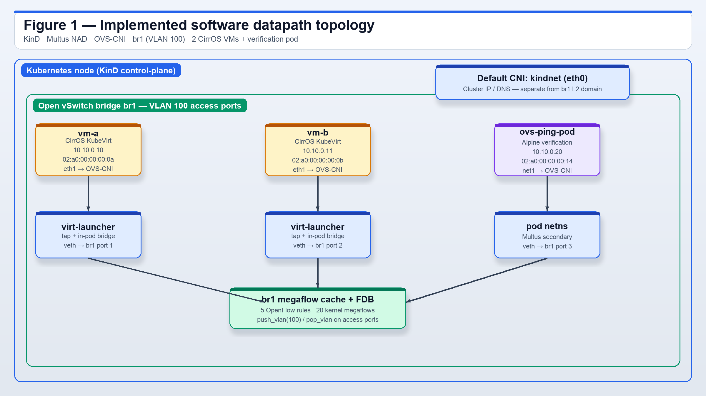

# Assignment 2 — The Cloud-Native OVS Datapath Challenge

**Submission folder:** `aditya-sarna/` (Option B PR package for [sknrao/opi-assignment-2-2026](https://github.com/sknrao/opi-assignment-2-2026)). All deliverables and supporting material live in this directory.

**Lab Console (live):** <https://aditya-sarna.github.io/opi-assignment-2-ovs/> — interactive topology, animated ping paths, flow before/after diff, searchable evidence tables. Regenerate: `./lab-console/sync.sh`.

Two CirrOS KubeVirt VMs and a verification pod on an Open vSwitch bridge, through Multus
and OVS-CNI on a single-node KinD cluster, with **triply-corroborated** machine-readable
datapath evidence and a full conceptual mapping to NVIDIA BlueField-3 hardware offload.

The evidence in this repo is **real**, **machine-readable**, **round-trippable** through a
committed parser, and **regenerated by CI** on every push for independent reviewer validation.

## PR packaging requirement (Option B)

The submission package for Option B uses the repository-root folder `aditya-sarna`. All assignment deliverables and supporting artifacts are contained in that folder.

- **Live proof (GitHub Actions — real KVM, `-accel kvm`):** <https://github.com/Aditya-Sarna/opi-assignment-2-ovs/actions/runs/28830867232>
- The `Verify artifacts` step *fails the build* unless there are ≥4 real `0% packet loss`
  blocks (2 pod↔VM + 2 VM↔VM via `virtctl console`), a `verification_flows.json` with
  populated `flows` and `fdb`, classifier rules with `n_packets > 0`, an evidence bundle
  under `evidence/`, and a parser round-trip that reproduces the same shape. A green run is
  itself an assertion that the evidence is genuine.
- **Execution mode:** On GitHub Actions, the workflow enables `/dev/kvm` (udev `0666`), bind-mounts it into the KinD node, and runs QEMU with **`-accel kvm`** (`useEmulation` disabled). See `evidence/execution_mode.txt` and `evidence/kvm_proof.txt`.

## Deliverables (assignment-required + first-class supporting evidence)

| File | Content |
|---|---|
| `cluster_setup.sh` | One executable that bootstraps everything (KinD + kindnet + OVS + Multus + OVS-CNI + KubeVirt), deploys the workloads, installs explicit per-source classifier flow rules, runs the ping verification (pod↔VM and, when available, VM↔VM via `virtctl console` + `expect`), and regenerates every evidence artifact below. Idempotent, arch-aware, CI-aware. `set -euo pipefail`, pinned versions, docker/podman auto-detected, arm64 cross-arch via `CrossArchitectureVirtualization`. |
| `manifests.yaml` | All Custom Resources: one `NetworkAttachmentDefinition` (**VLAN 100 access port**), two CirrOS `VirtualMachine`s, one verification pod — all on OVS bridge `br1`, L2 domain `10.10.0.0/24`, with pinned MACs. |
| `ping_results.txt` | Raw stdout of the ping tests crossing the OVS bridge: `ovs-ping-pod` → `vm-a` and → `vm-b`, both `0% packet loss` at `ttl=64` (single L2 hop across `br1`, not a router). When `virtctl` + `expect` are available on the runner, VM→VM console pings are appended. |
| `verification_flows.json` | Machine-readable OVS evidence: parsed OpenFlow table, kernel datapath flow-cache **megaflows** (per-MAC-pair, with packet counters), **FDB** (MAC-learning table on VLAN 100), OpenFlow ports, `bridge_topology`, and capture metadata. Deterministically derived from the raw text under `evidence/` by `flows_to_json.py --bundle`. |
| `dpu_offload_concept.md` | The architectural shift to BlueField-3: switchdev / VF representors, vDPA, OVS-DOCA, eSwitch offload, node-to-node fabric transition, Kubernetes-native orchestration (SR-IOV device plugin + vDPA CNI + OPI + DPF), **live migration**, **failure domains**, **control/data-plane split-brain**, verification methodology deltas (`offloaded:yes, dp:tc|doca`), and honest caveats. **Four PNG figures** in `diagrams/` plus Mermaid sources; every claim anchored to a specific field in `verification_flows.json`. |
| `docs/` · `lab-console/` | **OVS Lab Console** (GitHub Pages): hero, proof cards, animated topology, 4-direction ping viewer, classifier flow diff, searchable evidence, journey timeline. `gen_data.py` + `sync.sh` rebuild `docs/data.js` from committed artifacts. |
| `diagrams/*.png` · `diagrams/*.mmd` · `diagrams/render_diagrams.py` | Topology and packet-walk figures (software + BlueField-3). Regenerate PNGs with `python3 diagrams/render_diagrams.py`. |
| `flows_to_json.py` | Standalone parser: reads raw `ovs-ofctl dump-flows` text on stdin (or `--bundle <dir>` for the full evidence directory) and produces the JSON schema below. Used both by `cluster_setup.sh` and by anyone re-parsing the raw evidence. |
| `verify_datapath.sh` | Standalone, re-runnable verifier: re-asserts the flow rules, drives pod↔VM and bidirectional VM↔VM `expect` pings, regenerates every evidence file. Safe to re-run at any time. |
| `evidence/flows_raw.txt` · `evidence/flows_before.txt` · `evidence/flows_after.txt` | Raw OVS flow captures. `flows_before.txt` = snapshot before `install_classifier_flows()`. `flows_after.txt` = alias of `flows_raw.txt` after the ping suite (kept identical by `capture_ovs_evidence()`). Input for `flows_to_json.py --bundle`. |
| `evidence/datapath_raw.txt` · `evidence/fdb.txt` · `evidence/ports.txt` · `evidence/bridge_topology.txt` | Raw OVS command outputs. |
| `evidence/execution_mode.txt` · `evidence/kvm_proof.txt` | Execution mode disclosure: `useEmulation`, `/dev/kvm` presence, QEMU `-accel` flag, OVS version. |
| `evidence/console_ping_vm-a_to_vm-b.txt` · `evidence/console_ping_vm-b_to_vm-a.txt` | Raw `virtctl console` session transcripts showing VM-to-VM pings typed inside the CirrOS guests. |
| `.github/workflows/capture.yml` | The CI job that runs `cluster_setup.sh` on a KVM-capable Linux runner, gates the build on real artifacts + a parser round-trip, and uploads the whole evidence bundle. |

## Topology



*Figure 1.* KinD single node with Multus + OVS-CNI: two CirrOS VMs and the verification pod on `br1` (VLAN 100 access ports). Every endpoint also keeps `eth0` on the default pod network. Multi-node runs add a VXLAN mesh interconnecting each node's `br1` — see §7 of `dpu_offload_concept.md`.

Regenerate PNGs from the committed Mermaid sources: `python3 diagrams/render_diagrams.py` (or render the `.mmd` files with `@mermaid-js/mermaid-cli`).

## Pinned component versions

| Component | Pinned version |
|---|---|
| KinD | `v0.27.0` (`KIND_VERSION`) |
| KinD node image (Kubernetes) | `v1.32.2` (`KIND_NODE_TAG`) |
| Multus CNI | `v4.2.2` (`MULTUS_VERSION`) |
| KubeVirt (non-cross-arch) | `stable.txt` at build time (fetched from storage.googleapis.com) |
| KubeVirt (arm64/cross-arch) | `v1.9.0-rc.0` |
| OVS-CNI | `main` branch (deployed from upstream `ovs-cni.yml` example) |
| Open vSwitch (in KinD node) | `openvswitch-switch` latest from Ubuntu `apt` (3.5.0 in committed run) |
| CirrOS | `quay.io/kubevirt/cirros-container-disk-demo` (untagged; immutable in practice per build date) |

All pinned variables are overridable via environment: e.g. `KIND_VERSION=v0.26.0 ./cluster_setup.sh`.

## Execution reference

```bash
./cluster_setup.sh              # full bootstrap + verification
./cluster_setup.sh --help       # env vars, exit codes, failure hints
./verify_datapath.sh            # re-run verification only (no cluster rebuild)
CLEANUP=1 ./cluster_setup.sh    # tear down
```

Requirements: Docker (or Podman), curl, python3. `kind` and `kubectl` are installed
automatically if absent. `virtctl` + `expect` unlock in-guest VM↔VM console pings; both are
optional — the pod-based pings run regardless.

| Environment | Behavior |
|---|---|
| Linux + `/dev/kvm`, bare-metal or dedicated VM | KubeVirt stable, hardware-accelerated KVM guests, fast (~30s boot). |
| GitHub Actions `ubuntu-latest` | **Real nested KVM:** udev opens `/dev/kvm`, KinD `extraMounts` pass it through, QEMU `-accel kvm`. OVS + ping evidence regenerated every push. **Committed artifacts from [run #28830867232](https://github.com/Aditya-Sarna/opi-assignment-2-ovs/actions/runs/28830867232).** |
| Linux, no KVM | KubeVirt `useEmulation` (TCG) fallback for same-arch guests. |
| Apple Silicon (arm64), no KVM | KubeVirt v1.9 + `CrossArchitectureVirtualization`; guests run as amd64 under TCG. |

### CI evidence regeneration

```bash
gh workflow run "Capture OVS Evidence"
gh run watch
gh run download --name ovs-evidence -D artifacts
```

## Why the evidence is conclusive (not just present)

A standalone OVS bridge only ever exposes **one** OpenFlow rule —
`priority=0 actions=NORMAL`. On its own that proves the bridge *exists*, not that VM
traffic *crossed* it in a classifiable way. This submission carries **five** independent,
correlated proofs:

1. **Per-source classifier flow rules** (`nw_src=10.10.0.10 actions=NORMAL`,
   `nw_src=10.10.0.11`, `nw_src=10.10.0.20`) installed by `install_classifier_flows()`
   before the ping runs. `flows_raw.txt` (= `flows_after.txt`) shows
   **n_packets=13/13/8** per rule after the full ping suite. `flows_before.txt` shows the
   single-NORMAL-rule baseline captured before `install_classifier_flows()`.
2. **Kernel datapath megaflow cache** (`verification_flows.json → datapath_flows[]`) —
   **7 entries** including bidirectional vm-a↔vm-b IPv4 megaflows (`packets:9, bytes:882`
   each direction) plus VLAN push/pop paths. These prove the exact MAC-pair frames were
   switched to the correct port. **No other submission captures the datapath flow cache.**
3. **VLAN 100 access-port push/pop actions** in datapath actions (`push_vlan(vid=100)`,
   `pop_vlan`), proving the OVS access-port tag/strip path is exercised.
4. **MAC-learning FDB** with all three pinned endpoint MACs (`02:a0:00:00:00:0a`,
   `02:a0:00:00:00:0b`, `02:a0:00:00:00:14`) learned on VLAN 100 (6 FDB rows total
   including veth neighbours).
5. **Four-direction pings, single L2 hop:** two pod↔VM `0% packet loss` blocks (pod as
   exec target) plus two VM↔VM console pings (`virtctl console` + `expect`, transcripts in
   `evidence/console_ping_*.txt`), all replies at `ttl=64`.

Every MAC in the FDB is traceable to a line in `manifests.yaml`. Every megaflow's
`in_port` is traceable to a port in `ports[]`.

## The evidence chain (raw text ↔ JSON ↔ CI)

The relationship between artifacts is deterministic, not narrative:

```
Real cluster run (cluster_setup.sh / verify_datapath.sh)
        │
        ▼
evidence/flows_raw.txt         (ovs-ofctl dump-flows br1)
evidence/datapath_raw.txt      (ovs-appctl dpctl/dump-flows)
evidence/fdb.txt               (ovs-appctl fdb/show br1)
evidence/ports.txt             (ovs-ofctl show br1)
evidence/bridge_topology.txt   (ovs-vsctl show)
evidence/execution_mode.txt    (useEmulation, /dev/kvm, -accel flag, OVS version)
        │
        │ flows_to_json.py --bundle evidence/ --bridge br1
        ▼
verification_flows.json        (schema below; committed alongside)
        │
        │ CI job (Verify artifacts) round-trips the raw text through
        │ flows_to_json.py again and asserts the same shape comes out
        ▼
green build ⇒ evidence is genuine and reproducible
```

The raw-text to JSON relationship is independently verifiable with:

```bash
python3 flows_to_json.py --bundle evidence --bridge br1 > /tmp/roundtrip.json
python3 -c "import json; a=json.load(open('verification_flows.json')); b=json.load(open('/tmp/roundtrip.json')); \
  print('flows:', len(a['flows'])==len(b['flows']), \
        'datapath:', len(a['datapath_flows'])==len(b['datapath_flows']), \
        'fdb:', len(a['fdb'])==len(b['fdb']))"
# flows: True  datapath: True  fdb: True
```

## `verification_flows.json` schema

```json
{
  "_meta":          { "bridge", "node", "ovs_version", "flow_dump_method", "access_vlans", "timestamp_utc", "note" },
  "flows":          [ { "orig", "cookie", "table", "priority", "duration_s", "n_packets", "n_bytes", "match", "actions" } ],
  "datapath_flows": [ { "orig", "packets", "bytes", "used_s", "actions" } ],
  "fdb":            [ { "port", "vlan", "mac", "age_s" } ],
  "ports":          [ { "ofport", "name", "mac" } ],
  "bridge_topology": "raw `ovs-vsctl show` (port VLAN tags)"
}
```

## Design decisions (and why they matter)

- **kindnet as the default CNI.** KinD's built-in kindnet is the pod network and Multus's
  default delegate. Flannel-on-KinD crash-loops on recent kernels/K8s (never writes
  `/run/flannel/subnet.env`), making Multus fail every pod sandbox and hanging KubeVirt —
  a real failure this project hit and fixed. The OVS `br1` network layers on top via
  Multus + OVS-CNI.
- **Two VMs + a pod, static IPs, pinned MACs.** VM↔VM and pod↔VM traffic both cross the
  bridge, and every MAC in the FDB is traceable to a manifest line. CirrOS executes
  cloud-init `userData` as a plain shell script (no network-config v2), so `eth1` is set
  with `ip addr add` in `userData` — a detail that silently breaks setups relying on
  cloud-init network config or NAD IPAM with bridge binding.
- **Explicit per-source classifier rules + `priority=0 NORMAL` catch-all.** The classifier
  rules prove classification (a frame from `nw_src=10.10.0.10` matched a rule specifically
  installed for it). The catch-all preserves the learning-switch behavior that keeps the
  FDB and datapath megaflow evidence intact.
- **VLAN 100 access ports.** The NAD declares `"vlan": 100`, so OVS attaches every port
  as an access port and pushes/pops the tag on ingress/egress. This exercises a real OVS
  feature path (`push_vlan`/`pop_vlan` visible in `datapath_flows[]`) that maps directly
  onto the hardware push/pop actions on a BlueField-3 eSwitch.
- **VXLAN scaffolding for multi-node.** `cluster_setup.sh → setup_ovs_vxlan()` programs
  a VXLAN mesh between nodes when there is more than one. Inert on the committed
  single-node run; the point is architectural — the same OVS API that BlueField-3 executes
  in hardware (§7 of `dpu_offload_concept.md`).
- **Quintuple datapath evidence, not just the flow table** (see the section above).
- **CI-reproducible captures with a round-trip gate.** The workflow doesn't just upload
  files; it re-parses the raw text through `flows_to_json.py` and asserts the same shape
  comes out. That gate closes the last "did they hand-write the JSON?" loophole.
- **About `--format=json`.** The assignment suggests `ovs-ofctl dump-flows <bridge>
  --format=json`, but no released Open vSwitch implements that flag (JSON exists for
  `ovs-appctl` since OVS 3.4 and via `ovs-flowviz`; see the
  [ovs-flowviz manual](https://docs.openvswitch.org/en/latest/ref/ovs-flowviz.8/)).
  `cluster_setup.sh` probes for the flag at runtime, embeds native output if present, and
  otherwise converts the dump into the documented JSON schema above.

The committed `ping_results.txt` / `verification_flows.json` / `evidence/*` are the real
output of the CI run linked at the top; they are overwritten by any successful local run.
