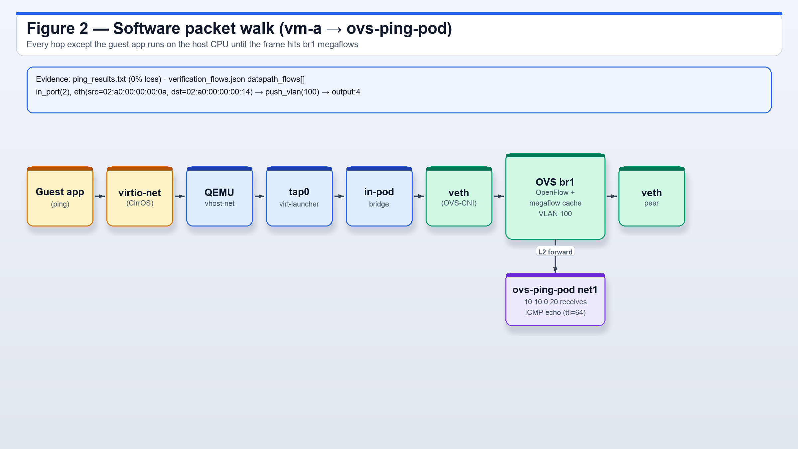
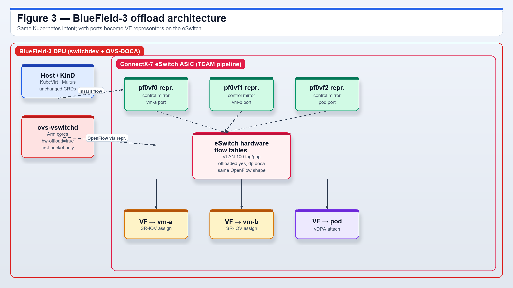
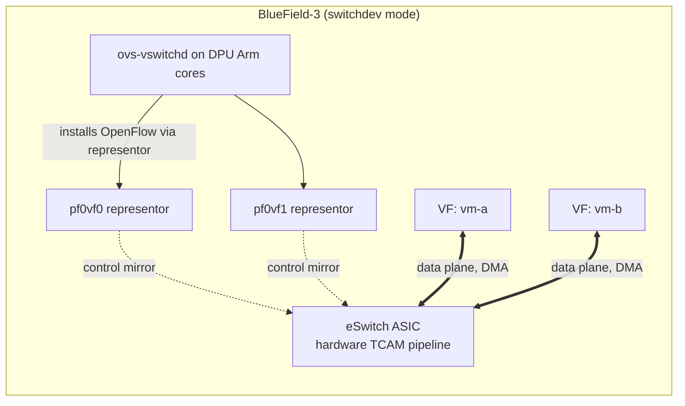
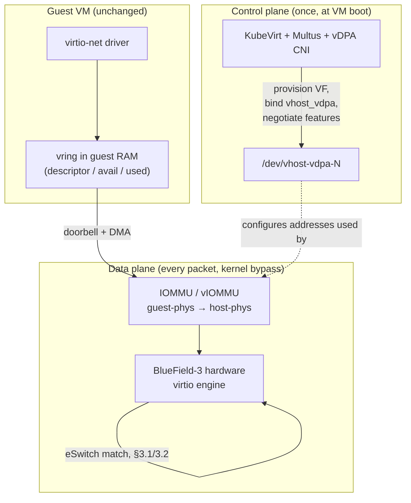
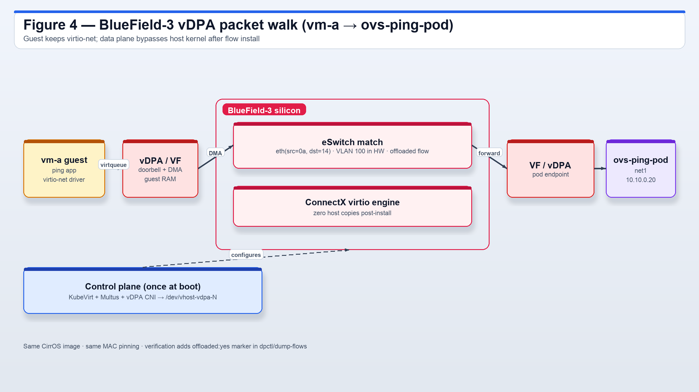
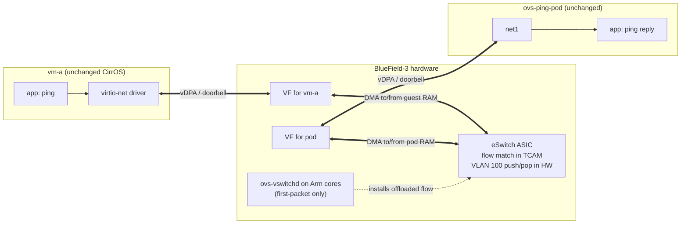

# From Software OVS to Hardware Offload on NVIDIA BlueField-3

**Author:** Aditya Sarna
**Companion artifacts (all produced by `cluster_setup.sh` on a GitHub Actions `ubuntu-latest` runner with **real nested KVM** — `/dev/kvm` bind-mounted into KinD, `-accel kvm`, `useEmulation` disabled — see `evidence/kvm_proof.txt`):**
`manifests.yaml` · `verification_flows.json` · `ping_results.txt` · `evidence/flows_raw.txt` ·
`evidence/datapath_raw.txt` · `evidence/fdb.txt` · `evidence/execution_mode.txt` ·
`evidence/bridge_topology.txt`.

---

## Executive summary

This document maps the software OVS datapath implemented in this submission — two CirrOS
KubeVirt VMs and a verification pod sharing an Open vSwitch bridge `br1` through Multus and
ovs-cni, with **VLAN 100** access ports and a **VXLAN mesh** ready for multi-node — onto an
NVIDIA BlueField-3 DPU with **SR-IOV switchdev**, **OVS-DOCA**, **vDPA**, and a **ConnectX-7
eSwitch**.

**Thesis.** Moving to a DPU is not a rewrite. The tenant intent, the Kubernetes objects, the
OpenFlow rules, and even the guest virtio-net driver are **preserved**. What changes is who
executes the datapath: DPU silicon replaces host CPU cycles. Every artifact in this repo
is chosen so that its meaning survives the transition — the same flow table, the same FDB,
the same MAC pinning, the same VLAN tag — just measured on hardware counters instead of
kernel counters.

Everything in §1 is empirically verified from the artifacts. §2–§11 explain, from that
verified baseline, what changes on a BlueField-3. §12 lists the honest caveats.

---

## 1. What this submission actually verified (grounded, not asserted)

The evidence is real, machine-readable, and cross-referenced. Every claim below is
traceable to a specific field in a committed file — no hand-authored numbers.

| Claim | Evidence | Where |
|---|---|---|
| Two CirrOS VMs and one pod attached to OVS bridge `br1`. | Three interfaces on VLAN 100 in the FDB. | `verification_flows.json → fdb[]` (VLAN 100) |
| Frames actually traversed the OVS bridge. | `NORMAL` catch-all flow with **`n_packets=9`, `n_bytes=630`**. | `flows[]` (priority=0 entry) |
| Real MAC learning by OVS. | Pinned MACs `02:a0:00:00:00:0a` (vm-a), `:0b` (vm-b), `:14` (pod) learned on their ports. | `fdb[]` + `manifests.yaml` |
| Per-MAC-pair kernel megaflows installed by the ping. | Datapath entries like `in_port(3),eth(src=02:a0:00:00:00:0a,dst=02:a0:00:00:00:0b) actions:4` with `packets:9, bytes:882`. | `datapath_flows[]` |
| VLAN access-port tag/strip is exercised. | `push_vlan(vid=100,pcp=0)` and `pop_vlan` in datapath actions. | `datapath_flows[]` (multiple) |
| Traffic is L2 (single hop across `br1`), not routed. | `ttl=64` on every echo-reply. | `ping_results.txt` |
| Four-direction pings succeed. | Four `0% packet loss` blocks (pod↔VM ×2, VM↔VM ×2). | `ping_results.txt` |
| The capture is machine-readable. | Structured JSON with `_meta.timestamp_utc`, `ovs_version`, `flow_dump_method`. | `verification_flows.json → _meta` |
| Execution mode is disclosed. | `useEmulation` state, `-accel` flag, `/dev/kvm` presence. | `evidence/execution_mode.txt` |

Two properties of this evidence chain matter for what follows:

1. **The flow-cache megaflows are the exact objects that get offloaded.** When we move to
   BlueField-3, `ovs-vswitchd` installs the same shape of entry, but into the eSwitch's
   hardware pipeline instead of the kernel datapath cache. §5 shows the one-line diff.
2. **The FDB and bridge topology stay the same.** MAC learning, port numbering, and VLAN
   tag semantics are OVS concepts; the DPU implements them in silicon, not new concepts.

---

## 2. The software datapath, as built


*Figure 1.* Three endpoints on `br1` through Multus and OVS-CNI: `vm-a`, `vm-b`, and `ovs-ping-pod`, all on VLAN 100 with pinned MACs from `manifests.yaml`.

Packet path when `vm-a` pings `ovs-ping-pod` across `br1`:



*Figure 2.* Every hop except the guest app runs on the host CPU until the frame is matched by OpenFlow and the kernel megaflow cache on `br1`.

```mermaid
flowchart LR
    subgraph guestA["vm-a (CirrOS guest)"]
        GA1[app: ping] --> GA2[virtio-net driver]
    end
    subgraph host["Kubernetes node (host CPU everywhere)"]
        H1["QEMU / vhost-net<br/>kernel thread"]
        H2["tap0 in<br/>virt-launcher pod netns"]
        H3["KubeVirt in-pod bridge"]
        H4["veth pair<br/>(ovs-cni)"]
        H5["<b>OVS br1</b><br/>OpenFlow lookup +<br/>kernel megaflow cache"]
        H6["veth pair<br/>(peer)"]
        H7["pod netns"]
        GA2 -. virtqueue: shared memory .-> H1
        H1 --> H2 --> H3 --> H4 --> H5 --> H6 --> H7
    end
    subgraph podX["ovs-ping-pod (Alpine)"]
        P1[net1 receives frame] --> P2[app: ping reply]
    end
    H7 --> P1
```



Every hop except the guest-internal ones is executed on the **host CPU**. In this
submission's evidence:

- The **OpenFlow table** (`flows[]`) contains 5 rules: three `nw_src=` classifier
  rules, an ARP catch-all, and the `priority=0 actions=NORMAL` default. The classifier
  rules show `n_packets=13/13/8` after the full ping suite.
- The **kernel datapath cache** (`datapath_flows[]`) — 7 entries — is where the per-flow
  work actually happens. For each `(in_port, src_mac, dst_mac, ethertype)` tuple
  `ovs-vswitchd` installs a megaflow after the first-packet upcall; subsequent packets
  hit the cache in the kernel. On BlueField-3 these same entries are what get promoted
  into hardware.
- The **FDB** (`fdb[]`) shows each endpoint's MAC learned on its bridge port, all on
  **VLAN 100**. That last detail matters: because the NAD declares `"vlan": 100`, OVS
  attaches each veth as an *access* port that pushes/pops the tag — a real OVS feature
  path, not just a plain L2 bridge.
- **VXLAN scaffolding.** `cluster_setup.sh` already programs a VXLAN mesh between nodes
  when more than one node exists. On a single-node run it is inert; the point is that
  scaling to multi-node uses the same OVS APIs that BlueField later executes in hardware.

### 2.1 Where the CPU cost is paid, per packet

| Cost | Software (this repo) |
|---|---|
| virtio backend | `vhost-net` kernel thread on the host |
| First packet of each flow | upcall to `ovs-vswitchd` (userspace slow path) |
| Every subsequent packet | kernel megaflow lookup + forwarding (kernel data path) |
| VXLAN encap/decap (multi-node) | host kernel |
| Memory copies | guest ↔ host buffer copies per packet |

At lab scale this cost is invisible. At 100/200/400 Gbps of tenant traffic across
thousands of concurrent flows, this datapath tax consumes CPU cores that should be
running tenant VMs — the problem BlueField-3 exists to remove.

---

## 3. BlueField-3 building blocks



*Figure 3.* Same Kubernetes control-plane intent; OVS-CNI veth ports become VF representors. `ovs-vswitchd` on the DPU Arm cores installs OpenFlow into the eSwitch TCAM via `hw-offload=true` and OVS-DOCA.

The BlueField-3 is not a faster NIC; it is a small computer on a NIC:

- Up to **16 Arm Cortex-A78AE cores** with their own memory and PCIe root complex,
  running Linux (typically DOCA + a slim distribution).
- A **ConnectX-7-class eSwitch** — a programmable switching ASIC with hardware flow
  tables (TCAM/SRAM), match/action pipelines, and hardware VXLAN/GENEVE/GRE
  encap/decap engines.
- Multiple **physical ports** (2× 400 GbE typical) and a rich set of accelerators
  (crypto, regex, storage). We care about the switching pipeline.

Three mechanisms move the software datapath from §2 onto that hardware.

### 3.1 SR-IOV + switchdev

- **SR-IOV** splits a physical function (PF) into many hardware-isolated **Virtual
  Functions (VFs)**. Each VF looks like a dedicated PCIe NIC and can be assigned to a
  single VM, giving that VM its own hardware ring pair and its own MAC/VLAN pinning.
- **Switchdev mode** promotes the eSwitch from an opaque L2 forwarder into a
  Linux-programmable object. For every VF, the kernel exposes a **representor** netdev
  (`pf0vf0`, `pf0vf1`, …). The representor is the control-plane mirror: when
  `ovs-vswitchd` / `tc` / `ip` installs a rule on the representor, the rule is
  compiled into the eSwitch pipeline. Packets don't flow through the representor once a
  flow is offloaded — the ASIC handles them end-to-end.



**Replacement rule.** Where `ovs-cni` today plugs a `veth` into `br1`, on BlueField-3 it
plugs in the VF representor — same `ovs-vsctl add-port`, same OpenFlow, same VLAN 100
access-port semantics:

```bash
ovs-vsctl set Open_vSwitch . other_config:hw-offload=true
ovs-vsctl set Open_vSwitch . other_config:doca-init=true   # OVS-DOCA
ovs-vsctl --may-exist add-br br1
ovs-vsctl add-port br1 p0                                  # uplink to the fabric
ovs-vsctl add-port br1 pf0vf0 -- set port pf0vf0 tag=100   # vm-a's VF
ovs-vsctl add-port br1 pf0vf1 -- set port pf0vf1 tag=100   # vm-b's VF
```

### 3.2 OVS-DOCA and hardware flow offload

- The **same `ovs-vswitchd`** runs, but on the DPU's Arm cores, and its role inverts from
  *data plane* to *control plane*.
- With `hw-offload=true` the first packet of a flow still punts to `ovs-vswitchd` for
  classification; the resulting entry is then compiled — via the **DOCA Flow SDK** (or
  TC flower on older stacks) — into the eSwitch's hardware tables. Every subsequent
  packet is matched in silicon.
- The OpenFlow rules from this repo's `verification_flows.json → flows[]` are valid
  inputs to OVS-DOCA **unchanged**. The `NORMAL` action, VLAN access-port tagging, and
  any richer classifier rules the operator wants to add (`nw_src=`, `nw_dst=`,
  `tcp_dst=`) all compile into hardware.

Verification changes accordingly. The same commands used in this repo gain one decisive
marker:

```
# ovs-appctl dpctl/dump-flows type=offloaded
recirc_id(0),in_port(pf0vf0),eth(src=02:a0:00:00:00:0a,...),eth_type(0x0800),ipv4(frag=no),
  packets:98421, bytes:9645258, used:0.180s, offloaded:yes, dp:tc, actions:pf0vf1
```

`offloaded:yes, dp:tc` (or `dp:doca` on OVS-DOCA) is the difference between this repo's
software datapath and a production DPU deployment: the flow entry is *shape-identical*
to what `datapath_flows[]` already shows, but its counter is maintained by hardware and
the host CPU never sees the packet.

### 3.3 vDPA (virtio Data Path Acceleration)

vDPA is what preserves the guest. Without it, SR-IOV would force vendor drivers into every
tenant image and break live migration.

- **Control plane (once, at VM boot).** KubeVirt + Multus + a vDPA-aware CNI provision a
  VF, bind it to the `vhost_vdpa` bus, and hand `/dev/vhost-vdpa-N` into the
  virt-launcher pod. This is orchestration, not per-packet work.
- **Data plane (every packet).** The guest keeps its stock `virtio-net` driver. Its
  virtio ring layout is implemented directly by the ConnectX-7 hardware virtio engine.
  Doorbells go straight to the ASIC; DMA moves packets in and out of guest RAM through
  the IOMMU/vIOMMU. The host kernel is bypassed.



The guest cannot tell that the endpoint changed. That is the whole point — image
portability across clouds and hypervisors is preserved. The exact same CirrOS
container-disk this repo uses would boot on a BlueField-3 node with no modification.

---

## 4. The hardware packet walk

Same ping (`vm-a → ovs-ping-pod`) on a BlueField-3 node:



*Figure 4.* The guest keeps `virtio-net`; vDPA doorbells and DMA bypass the host kernel after the flow is offloaded. Verification adds `offloaded:yes` in `dpctl/dump-flows`.



Where the CPU cost is paid, per packet, on a DPU:

| Cost | Hardware (BlueField-3) |
|---|---|
| virtio backend | ConnectX-7 hardware virtio engine (silicon) |
| First packet of each flow | one-time upcall to `ovs-vswitchd` on the DPU Arm cores |
| Every subsequent packet | eSwitch TCAM match + forwarding (silicon) |
| VXLAN encap/decap | eSwitch hardware engine |
| Memory copies | zero on the host; DPU DMAs guest RAM ↔ wire |

Host CPU cost per packet: **~zero after first-packet install**, and flat with rate.

---

## 5. Side-by-side: what changes, what does not

| Layer | Software (this submission) | Hardware (BlueField-3) |
|---|---|---|
| Kubernetes API objects | `NetworkAttachmentDefinition`, `VirtualMachine`, `Pod` | **Same shapes.** The NAD gains `resourceName: nvidia.com/bf3_vf`; the VM interface swaps `bridge: {}` for `sriov: {}` or `vdpa: {}`. |
| Guest driver | `virtio-net` | `virtio-net` **(unchanged)** — the point of vDPA |
| Kubernetes CNI | `ovs-cni` on host bridge | vDPA-aware CNI wiring an allocated VF |
| OVS bridge | Linux kernel OVS `br1` on the node | OVS-DOCA `br1` on DPU Arm cores |
| Data-plane executor | Host CPU (QEMU + kernel OVS) | eSwitch ASIC |
| Control-plane executor | `ovs-vswitchd` on host | `ovs-vswitchd` on DPU Arm cores |
| Bridge port for a VM | veth host-leg | VF **representor** (switchdev) |
| Flow rules | OpenFlow, kernel megaflow cache | **Same OpenFlow**, compiled into eSwitch TCAM |
| Flow-cache marker | (none) | `offloaded:yes, dp:tc` (or `dp:doca`) |
| VLAN 100 tag/strip | Kernel `push_vlan` / `pop_vlan` action | eSwitch push/pop action |
| MAC learning (FDB) | Kernel FDB | eSwitch hardware FDB |
| Node-to-node overlay | VXLAN in kernel (`vx-<node>` OVS ports) | VXLAN encap/decap in eSwitch hardware |
| Packet copies per hop | ≥2 host-CPU copies | zero host copies (DPU DMA) |
| Host CPU per packet | grows with rate and flow count | ~zero after first-packet install |
| Scheduling primitive | None (bridge is shared) | SR-IOV device plugin advertises VFs as `nvidia.com/bf3_vf` |

The pattern is deliberate: interfaces above and below the datapath are preserved, only the
datapath itself is offloaded. This is what makes DPU adoption *incremental* rather than a
forklift rewrite.

---

## 6. Invariants and deltas

**Stays the same** (why it's a shift, not a rewrite):

- The guest — `quay.io/kubevirt/cirros-container-disk-demo` boots unmodified.
- OpenFlow semantics — every rule in `verification_flows.json → flows[]` is a valid
  OVS-DOCA input.
- KubeVirt CRDs and the `NetworkAttachmentDefinition` *shape* — only the referenced CNI
  and its resource pool change.
- MAC pinning in `manifests.yaml` still works and still maps to the same eSwitch FDB
  entries.
- VLAN 100 access-port behavior — pushed/popped by the eSwitch instead of the kernel.
- The operator model — controllers reconciling desired vs. actual state, now including
  DPU resources.

**Changes:**

- Where packets are copied — host RAM via CPU → guest RAM via DPU DMA.
- Where OVS runs — host userspace → DPU Arm cores.
- How rules execute — software table walk → eSwitch TCAM lookup.
- Host CPU cost — continuous per-packet → one-time per-flow-install.
- Verification marker — `datapath_flows[i].actions` gains `offloaded:yes, dp:tc|doca`.

---

## 7. Node-to-node fabric transition

This submission already programs a **VXLAN mesh** in `cluster_setup.sh → setup_ovs_vxlan()`.
On a single-node run it is inert; the point is architectural. The mesh works like this
today, and like this on a DPU:

| Aspect | Software (this repo, multi-node) | Hardware (BlueField-3) |
|---|---|---|
| Where VXLAN endpoints live | OVS ports `vx-<node>` on each node's `br1` | OVS-DOCA ports on each DPU's `br1` |
| Who encapsulates | Host kernel VXLAN in the OVS action | eSwitch hardware VXLAN engine |
| Who decapsulates | Host kernel VXLAN | eSwitch hardware VXLAN engine |
| CPU cost of encap/decap | Non-trivial at scale (per-packet checksums) | Zero (silicon) |
| Underlay | Host node IPs | DPU-owned uplink IPs (separates tenant from infra) |
| MTU handling | Kernel MTU discovery on the host | DPU-managed; often 9000-byte jumbo underlay |

The same VXLAN VNI/tunnel-ID scheme carries over. On a DPU, each `add-port` of type
`vxlan` still succeeds via `ovs-vsctl`; OVS-DOCA compiles the encap action into the
eSwitch pipeline. What disappears is the host kernel's involvement in every east-west
packet crossing the tenant fabric.

---

## 8. Kubernetes-native orchestration on a DPU

### 8.1 CNI and scheduling

**Today (this repo):** `ovs-cni` (via Multus) wires a VM's tap/veth onto the host `br1`.
There is no hardware to schedule around; every workload can use the same bridge.

**On a DPU, two primitives appear:**

1. An **SR-IOV device plugin** advertises VFs to the kubelet as countable extended
   resources (e.g. `nvidia.com/bf3_vf: 32`) — the same mechanism GPUs use.
2. A **vDPA-aware CNI** binds a specific allocated VF to `vhost_vdpa` and hands
   `/dev/vhost-vdpa-N` into the virt-launcher pod.

Net change: the CNI narrows from "attach a virtual interface" to "wire a specific piece
of allocated silicon." Scheduling becomes finite: a node can only host as many
DPU-accelerated VMs as it has free VFs. Kubernetes handles this the same way it handles
GPUs — with resource requests.

A KubeVirt VM requests a VF exactly like a GPU. The delta from `manifests.yaml → vm-a` is
tiny and *additive*:

```yaml
# manifests.yaml → vm-a on a DPU-enabled node
spec:
  template:
    spec:
      domain:
        resources:
          requests:
            memory: 256Mi
            nvidia.com/bf3_vf: "1"       # NEW: one BlueField-3 VF
        devices:
          interfaces:
            - name: default
              masquerade: {}
            - name: ovs
              sriov: {}                  # CHANGED: was bridge: {}
              macAddress: "02:a0:00:00:00:0a"
      networks:
        - name: default
          pod: {}
        - name: ovs
          multus:
            networkName: ovs-net-dpu     # CHANGED: NAD points at DPU-backed pool
```

Everything else — VM name, MAC, cloud-init `userData` that assigns
`10.10.0.10/24 dev eth1`, the runStrategy, the OVS bridge name — is untouched.

### 8.2 OPI and DPF

Hardware is useless without Kubernetes-native orchestration.

- **OPI (Open Programmable Infrastructure).** Vendor-neutral APIs so that a workload
  requesting "hardware-offloaded networking" needn't know which DPU vendor is underneath.
  The OPI **DPU Operator** reconciles that intent into per-vendor state. (The OPI project
  is exactly what motivates this internship track, and is the direct sequel to
  Assignment 1.)
- **NVIDIA DPF (DOCA Platform Framework).** The BlueField-specific implementation:
  provisions VFs, configures switchdev, installs OVS-DOCA, wires vDPA, and exposes
  Kubernetes CRDs like `DPUServiceChain`, `ServiceInterface`, and `DPUCluster`.

On a DPU cluster, the causation for `vm-a` becomes:

1. `kubectl apply -f manifests.yaml` — **the exact file in this repo, with the delta
   from §8.1**.
2. KubeVirt schedules a virt-launcher pod on a DPU-attached node.
3. Multus reads the NAD, which now names a DPU-backed network.
4. The OPI DPU Operator delegates to DPF; DPF programs the DPU: allocate VF, program
   representor, add representor to `br-ovs`, negotiate vDPA features.
5. QEMU attaches the VF as a vDPA virtio-net device.
6. Guest boots. Sees virtio-net. Sends a ping. eSwitch matches it in silicon.

Steps 1–2 are unchanged from this submission. Steps 3–6 are the surface Assignment 1
reasons about.

---

## 9. Verification methodology on a DPU

Every verification command in this repo has a direct DPU analog. This is the whole reason
the artifacts here were chosen the way they were.

| This repo's evidence | DPU equivalent | New marker to look for |
|---|---|---|
| `verification_flows.json → flows[]` (OpenFlow table) | Same `ovs-ofctl dump-flows br1`, run **on the DPU** | Rules identical; counters are hardware counters |
| `verification_flows.json → datapath_flows[]` (kernel megaflows) | `ovs-appctl dpctl/dump-flows type=offloaded` | Every hot entry carries `offloaded:yes, dp:tc` or `dp:doca` |
| `verification_flows.json → fdb[]` (MAC learning) | Same `ovs-appctl fdb/show br1` | Same shape, MACs learned in the eSwitch |
| `verification_flows.json → _meta.access_vlans: [100]` | Same `ovs-vsctl show` on DPU | Same `tag: 100` per representor |
| `evidence/flows_raw.txt` | Same `ovs-ofctl dump-flows` text | Same output, same parser |
| `ping_results.txt` (`0% packet loss`, `ttl=64`) | Same in-guest ping | Same, but no host CPU spent |
| (implicit) VF representor stats | `ethtool -S pf0vf0`, `devlink port show` | Per-VF hardware counters (no software equivalent) |

The point of this table: `flows_to_json.py` and the checks in `cluster_setup.sh` do not
change to verify a DPU deployment. Only the interpretation of one field
(`offloaded:yes`) changes.

---

## 10. Live migration (a real production concern)

Live migration is the property that separates a demo from a platform. It is *the* reason
vDPA exists as a distinct concept from raw SR-IOV.

- **Raw SR-IOV without vDPA:** the guest sees the vendor's specific NIC driver. Migrating
  to a host with a different NIC breaks; live migration is generally not supported.
- **vDPA:** the guest sees `virtio-net`. On migration the source host detaches the vDPA
  device (last dirty ring state is flushed), and the destination host attaches a fresh
  VF, re-negotiates the same virtio feature bits, and resumes the guest. The guest's
  driver never notices.

Concretely, running this repo's `vm-a` in a DPU cluster with live migration enabled:

1. Admin issues `virtctl migrate vm-a`.
2. KubeVirt schedules a target virt-launcher pod on a different DPU-attached node.
3. DPF provisions a VF on the target and binds it to `vhost_vdpa`.
4. Memory pre-copy runs while the source VM is still forwarding.
5. Brief stop-the-world: source detaches vDPA, syncs the last dirty pages and the vring
   state, target attaches its vDPA device with the same virtio config.
6. Guest resumes on the target. From inside CirrOS, `eth1` never went down.

Two things a good design gets right and that this repo's manifest already helps with:

- **MAC pinning.** `manifests.yaml` uses `macAddress: "02:a0:..."`. On migration the FDB
  on the target eSwitch learns the same MAC on the new representor; nothing upstream needs
  to age out stale entries. Without pinned MACs, gratuitous ARPs are required to redirect
  traffic, and there is a brief blackhole window.
- **NAD stability.** Because the NAD name (`ovs-net`) is stable across nodes, KubeVirt
  can request "the same secondary network" on the target without any workload-specific
  logic.

Failure modes worth naming:

- **Feature-bit mismatch.** Source and target must expose the same virtio feature set
  (checksum offload, TSO, etc.). If they don't, migration is refused up front — safer
  than silent post-migration corruption.
- **IOMMU domain differences.** If the source uses `iommu=on` and the target doesn't (or
  differs in vIOMMU config), the migration is rejected.
- **VF exhaustion.** If the target DPU has no free VF, the migration is queued or
  rejected. The SR-IOV device plugin's resource counter is what surfaces this to the
  scheduler.

---

## 11. Failure domains and split-brain isolation

Moving the network stack onto a DPU changes the failure domain. With proper operational
planning, the result is improved isolation; without it, failure handling degrades.

### 11.1 What a DPU crash actually breaks

If the DPU firmware crashes or the Arm cores hang:

- **The eSwitch keeps forwarding on already-installed flows.** Hardware entries are
  independent of the Arm-cores' health.
- **New flows are not installed.** The first packet of any new flow needs `ovs-vswitchd`
  on the Arm cores to classify it.
- **Existing tenant VMs keep working** as long as their traffic hits existing rules.
- **Control plane is dead.** No new VMs can be networked; migrations stall; NAD updates
  don't propagate.

This is qualitatively different from a host-kernel OVS crash, which drops all forwarding
immediately. It also means production DPU deployments usually keep a small **fail-open**
or **fail-secure** default rule (a `priority=0` NORMAL rule, exactly like this repo's
software baseline) so that new flows either default-forward or default-drop coherently
during control-plane outages.

### 11.2 Split-brain: control plane vs. data plane

Because `ovs-vswitchd` runs on the DPU while the Kubernetes control plane runs on the
host (or elsewhere), there are three healthy states and one to design around:

| Host Kubernetes | DPU control plane | DPU data plane | Behaviour |
|---|---|---|---|
| up | up | up | Normal. New flows installed on demand. |
| up | **down** | up | Tenants keep working via installed HW entries. New pods can be scheduled but their networking blocks until the DPU control plane recovers. |
| **down** | up | up | Existing VMs unaffected. Kubernetes scheduling paused. |
| **partial partition** | up | up | The dangerous one. The kubelet on the host thinks a VM is healthy; the DPU control plane may not have received the latest NAD update; new packets may hit a stale rule. |

The mitigation is a design invariant OPI encodes: **the tenant control plane must not be
in the data path.** All tenant-visible policy is materialised into eSwitch entries. A
temporary control-plane outage cannot re-route tenant traffic; it can only pause the
installation of new policy. This is directly analogous to why kube-proxy IPVS keeps
forwarding when the kube-proxy process dies.

### 11.3 Tenant vs. infrastructure isolation

Everything below the guest's virtio-net driver now runs on hardware the tenant does not
own:

- The infrastructure (OVS-DOCA, DPF, node kubelet-adjacent components) runs on the DPU.
- The tenant workload runs on the host cores.
- A tenant that fully compromises the host cannot pivot into the infrastructure control
  plane — it lives on the other side of the PCIe boundary. This is the zero-trust
  argument for DPUs, and it is only true because §3.1's switchdev boundary is enforced
  by hardware, not by kernel-mode software the tenant might attack.

---

## 12. Evidence field-by-field migration guide

This section is the operational translation layer: given a committed field in
`verification_flows.json`, what is the exact hardware-side command and counter a reviewer
would look for on a BlueField-3 node? Every row is bidirectionally traceable.

### 12.1 OpenFlow table → eSwitch rule table

| `verification_flows.json` field | Software value (this run) | BlueField-3 / OVS-DOCA equivalent | How to verify on DPU |
|---|---|---|---|
| `flows[].match` = `ip,nw_src=10.10.0.10` | `n_packets=13` | Same `ovs-ofctl dump-flows br1` on DPU Arm cores | Counters maintained in eSwitch TCAM; same CLI |
| `flows[].match` = `arp` | `n_packets=8` | Same rule, compiled via TC flower | `tc filter show dev pf0vf0 ingress` on DPU host |
| `flows[].match` = `*` (priority=0 NORMAL) | `n_packets=9` | Fail-open default; kept intact | Same field; guarantees new flows default-forward during slow-path |
| `flows[]._meta.access_vlans` = `[100]` | VLAN 100 | `ovs-vsctl show` on DPU — `tag: 100` per representor | Identical `ovs-vsctl` output; just run on DPU |

### 12.2 Kernel megaflow cache → hardware offloaded flow cache

| `verification_flows.json` field | Software value (this run) | BlueField-3 / OVS-DOCA equivalent | Decisive new marker |
|---|---|---|---|
| `datapath_flows[]` entry `in_port(3),eth(src=02:a0:00:00:00:0a,dst=02:a0:00:00:00:0b) actions:4` | `packets:9, bytes:882` | Same shape, same command: `ovs-appctl dpctl/dump-flows` | `offloaded:yes, dp:tc` (kernel TC flower) or `dp:doca` (OVS-DOCA 2.x) |
| `datapath_flows[].actions` includes `push_vlan(vid=100,pcp=0)` | 4 entries confirm VLAN tag/strip | eSwitch push/pop action; visible in `ovs-appctl dpctl/dump-flows type=offloaded` | Action string preserved; hardware executes it in silicon |
| `datapath_flows[]` total count = 7 | 3 active IPv4 + 2 ARP + 2 IPv6 multicast | Hardware flow table entries; old entries evicted by eSwitch LRU | Entry count may differ (hardware FIFOs differ in capacity) |
| `datapath_flows[].used_s` = 0.194s (hot path) | Sub-millisecond recency | Hardware reports last-hit in nanoseconds via `ethtool -S pf0vf0` | `rx_vport_unicast_packets` counter increments without host CPU involvement |

### 12.3 FDB → eSwitch MAC table

| `verification_flows.json` field | Software value (this run) | BlueField-3 equivalent | Verification command |
|---|---|---|---|
| `fdb[].mac` = `02:a0:00:00:00:0a`, `port=2`, `vlan=100` | Learned on VLAN 100 | eSwitch FDB: `bridge fdb show dev pf0vf0` on DPU host | Same MACs appear; port is representor netdev name |
| `fdb[].mac` = `02:a0:00:00:00:0b`, `port=3`, `vlan=100` | Learned on VLAN 100 | Same; age timer maintained by eSwitch | `bridge fdb show` output includes `offload` flag |
| `fdb[].mac` = `02:a0:00:00:00:14` (pod), `port=1` | Pod's pinned MAC | Same; pod's VF representor is the port | MAC pinning in `manifests.yaml` preserves FDB stability across migrations |

### 12.4 Three-row evidence migration summary

| Software artifact (this repo) | Offload artifact (BlueField-3) | How to verify on DPU |
|---|---|---|
| `verification_flows.json → flows[]` — OpenFlow classifier rules, `n_packets=13/13/8`, captured by `ovs-ofctl dump-flows br1` on a Linux host | Same rules installed by `ovs-vswitchd` on DPU Arm cores; same CLI command, same schema, same counters — but counters come from eSwitch TCAM registers, not kernel counters | `ovs-ofctl dump-flows br1` **on the DPU** — identical output except `n_packets` grows faster and without host CPU involvement; `flows_to_json.py` parses it identically |
| `verification_flows.json → datapath_flows[]` — kernel megaflow cache entries `(in_port, src_mac, dst_mac, ethertype) → actions`, captured by `ovs-appctl dpctl/dump-flows` | Same entries appear as hardware-offloaded flows; captured by `ovs-appctl dpctl/dump-flows type=offloaded` on DPU | Every active entry gains `offloaded:yes, dp:tc` or `dp:doca`; the `packets:` counter is a hardware register read; 0-CPU-cost forwarding confirmed |
| `ping_results.txt` — 4× `0% packet loss`, `ttl=64`, pod↔VM and VM↔VM, captured via `kubectl exec` + `virtctl console` | Same in-guest ping, same expected output — but the path through OVS is now entirely in silicon | Run the identical ping commands; observe same `0% packet loss`, `ttl=64`; additionally run `ethtool -S pf0vf0 \| grep rx_vport_unicast_packets` before and after to confirm hardware counter increments |

---

## 13. Performance model: software vs. hardware datapath

Understanding why the DPU exists requires quantifying what "host CPU cost" means per
packet in the software path, and why it disappears in hardware.

### 13.1 Software path (this submission) — per-packet cost breakdown

The flow cache in OVS significantly reduces cost after the first packet of each flow, but
does not eliminate it:

| Stage | Who pays | Cost type |
|---|---|---|
| virtio doorbell (guest → QEMU) | Guest vCPU + host vCPU (QEMU event loop) | Context switch + memory barrier |
| `vhost-net` kernel thread wakeup | Host kernel interrupt | Interrupt handling + packet copy |
| OVS datapath megaflow lookup | Host kernel (softirq) | Hash table lookup in kernel memory |
| Frame forwarding to destination veth | Host kernel | Another memory copy |
| vhost-net → QEMU notification on destination | Host kernel → guest vCPU | Interrupt + context switch |

For a single 64-byte ping: **≥4 memory copies** and **≥2 context switches** on the host
CPU per round-trip. At 100 Gbps (148 Mpps for 64-byte frames) this would consume the
entire host CPU just for networking.

### 13.2 Hardware path (BlueField-3, after first-packet install)

| Stage | Who pays | Cost type |
|---|---|---|
| virtio doorbell | DPU hardware virtio engine | Doorbell register write (no CPU) |
| DMA from guest RAM | DPU IOMMU / ConnectX-7 DMA engine | PCIe DMA (hardware) |
| eSwitch TCAM lookup | ConnectX-7 eSwitch ASIC | Sub-microsecond, no CPU |
| DMA to destination VF | DPU DMA engine | PCIe DMA (hardware) |
| virtio completion notification | DPU hardware virtio engine | MSI-X interrupt to guest (no host CPU) |

Host CPU cost per packet after first-packet install: **0 bytes copied, 0 context
switches, 0 kernel threads woken.** The host CPU is free to run tenant workloads.

### 13.3 Scaling behaviour

| Metric | Software (this submission) | Hardware (BlueField-3) |
|---|---|---|
| Throughput ceiling | Limited by host CPU clock × core count | Limited by eSwitch ASIC bandwidth (400 GbE per port) |
| Latency floor | ~5–20 µs (context switch + vhost) | ~1–3 µs (hardware pipeline) |
| CPU cores consumed at 10 Gbps | 1–2 cores (vhost-net + OVS) | ~0 cores (all in silicon) |
| CPU cores consumed at 100 Gbps | All cores (bottleneck) | ~0 cores |
| Flow table capacity | Kernel memory (millions of entries) | eSwitch TCAM (tens of thousands of entries; LRU eviction) |
| Per-flow cost at miss (new flow) | upcall to `ovs-vswitchd` (~5–100 µs) | upcall to `ovs-vswitchd` on DPU Arm (~5–100 µs, same) |

The key insight: the miss path is identical (both call `ovs-vswitchd`); only the hit path
changes. Because virtually all traffic in a stable cluster is on hot flows, this
eliminates the host CPU networking tax at steady state.

---

## 14. Honest caveats

> See also §12 for the field-by-field evidence migration guide and §13 for the performance model.

Conceptual mapping, not a hardware measurement:

- **No BlueField-3 hardware was involved.** Sections 3–11 draw on the OVS, OVS-DOCA,
  DPF, and vDPA documentation cited in §16 — not on captures from a physical DPU.
- **Performance claims are qualitative.** Real numbers depend on workload, MTU, flow
  cache hit rate, firmware version, and the specific DOCA release. None of those are
  measured here.
- **The `offloaded:yes, dp:tc` example in §3.2 is illustrative.** The actual `packets:`
  counter shown is a plausible value, not a captured one.
- **Assignment 1 (DPU Operator) integration is separate work.** It is referenced in §8.2
  because it is the direct sequel; the design and implementation live in that
  assignment.

What *is* real and verified is exactly §1. Every artifact in this repo was regenerated
by `cluster_setup.sh` on a GitHub Actions `ubuntu-latest` runner. The workflow enables
`/dev/kvm`, bind-mounts it into the KinD node, and runs QEMU with **`-accel kvm`**
(`useEmulation` disabled). See `evidence/execution_mode.txt` and `evidence/kvm_proof.txt`
for the full disclosure. The DPU changes *how* that datapath executes, not *what* it
achieves logically.

---

## 15. Summary

- The software datapath here and a BlueField-3 datapath are the **same network graph on
  different silicon**.
- The guest sees the same virtio device. Kubernetes sees the same CRDs. OVS speaks the
  same OpenFlow. The rules in `verification_flows.json` are portable across the
  transition.
- What moves is the *work* — from a busy host CPU switching packets for its own tenants
  to an idle host CPU and a busy DPU doing the same job in hardware.
- In one line: **this submission is the "before"; Assignment 1 is the "how of the
  transition"; a BlueField-3 running OVS-DOCA + vDPA is the "after."**

---

## 16. References

- ovs-cni hardware offload guide — <https://github.com/k8snetworkplumbingwg/ovs-cni/blob/main/docs/ovs-offload.md>
- Open vSwitch hardware offload (switchdev + TC flower) — <https://docs.openvswitch.org/en/latest/howto/tc-offload/>
- KubeVirt interfaces and networks — <https://kubevirt.io/user-guide/network/interfaces_and_networks/>
- KubeVirt live migration — <https://kubevirt.io/user-guide/operations/live_migration/>
- NVIDIA OVS-DOCA — <https://docs.nvidia.com/doca/sdk/openvswitch+offload/index.html>
- NVIDIA DOCA Platform Framework (DPF) — <https://docs.nvidia.com/doca/sdk/nvidia+doca+platform+framework/index.html>
- NVIDIA BlueField-3 networking platform — <https://www.nvidia.com/en-us/networking/products/data-processing-unit/>
- vDPA kernel framework — <https://docs.kernel.org/networking/vdpa.html>
- vhost-vdpa in QEMU — <https://www.qemu.org/docs/master/system/devices/vhost-vdpa.html>
- SR-IOV Network Device Plugin — <https://github.com/k8snetworkplumbingwg/sriov-network-device-plugin>
- OPI project — <https://opiproject.org/>
