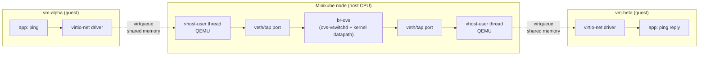
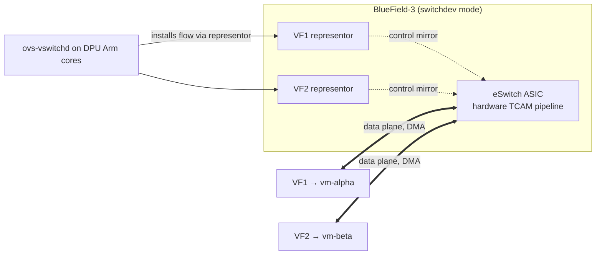
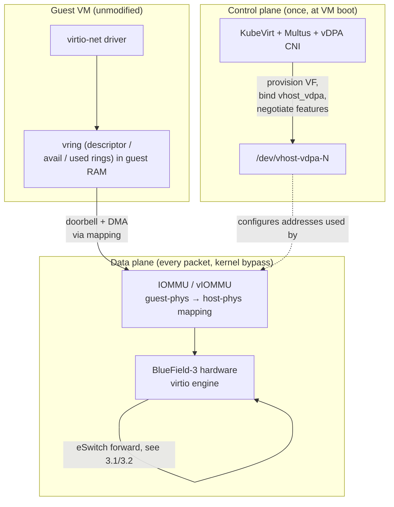
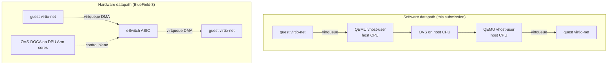

# DPU Offload Concept: From Software Datapath to BlueField-3 Hardware Acceleration

**Author:** Yash Pratap Singh
**Assignment:** OPI Internship — Hands-On Assignment 2
**Companion artifacts:** `cluster_setup.sh`, `manifests.yaml`, `verify_datapath.sh`, `verification_flows.json`, `ping_results.txt`, `flows_after.txt`, `kvm_proof.txt`, `qemu_accel.txt`

---

## 1. What this submission actually achieved (the verified baseline)

Before the hardware discussion, here is what was **built and proven** on a real machine — not described, but captured:

- **Real hardware virtualization.** Two CirrOS KubeVirt VMs run on genuine KVM, verified end-to-end: `/dev/kvm` present on both the WSL host and the minikube node, matching `vmx` flag counts, no KubeVirt emulation override, and `-accel kvm` on the live QEMU process (`kvm_proof.txt`, `qemu_accel.txt`).
- **Real east-west traffic through OVS.** `vm-alpha` (192.168.100.1) and `vm-beta` (192.168.100.2) ping each other over a dedicated OVS-only subnet, 0% loss both directions (`ping_results.txt`).
- **Real, classified flows.** The OVS flow dump shows the ping traffic hitting explicit per-source rules, not just a default forward (`verification_flows.json`, backed by raw `flows_after.txt`).

The rest of this document maps that *same* software datapath onto an NVIDIA BlueField-3 DPU with hardware offload. That hardware portion is **conceptual** — no DPU was available (see §7) — but grounded throughout in the concrete setup above.

**Thesis:** moving to a DPU is *not a rewrite*. The guest, the Kubernetes API, and the OpenFlow rules all stay the same. Only *who executes the datapath* changes — DPU silicon instead of host CPU cycles.

---

## 2. The Software Datapath (What This Submission Runs)

A ping from `vm-alpha` to `vm-beta` traverses this path on a single host:



Where the host CPU is spent — every packet costs cycles at four points:

- The two vhost-user copies (one per guest).
- The OVS flow-table lookup.
- The OVS forwarding action.

Why it matters:

- For a handful of ICMP packets this is invisible.
- At ~100 Gbps of tenant traffic the same design burns 6–10 host CPU cores purely on networking.
- **That CPU cost is what the DPU exists to eliminate.**

### 2.1 Why this verification setup is rigorous

Designed so the test *cannot* pass unless traffic genuinely crossed OVS:

- **A dedicated `192.168.100.0/24` subnet on `eth1` only**, assigned at boot via cloud-init (see `manifests.yaml`).
  - This range exists nowhere else — not on the pod network (`10.244.0.0/16`), not on any host interface — so the only route between the VMs is through `br-ovs`.
  - A successful inter-VM ping therefore *must* have traversed the bridge. (A ping to a pod-network address would pass whether or not OVS worked, which is why that weaker test proves nothing.)
- **Two real KubeVirt guests** — not netns endpoints or a single VM — the actual east-west scenario the assignment models.
- **Explicit `nw_src` classifier rules**, not a bare `NORMAL` catch-all.
  - The flow dump then shows classification *by source*.
  - The per-rule `n_packets` counters become direct evidence of which VM's traffic hit which rule.

### 2.2 The OVS bridge is real

- `br-ovs` is a genuine Open vSwitch bridge inside the minikube node (`ovs-vsctl add-br br-ovs`), daemon started manually past `policy-rc.d`.
- The rules in `verification_flows.json` were installed into that live `ovs-vswitchd`.
- `flows_after.txt` preserves the raw `ovs-ofctl dump-flows` output behind the typed JSON — nothing in the software datapath was mocked.

### 2.3 Evidence the rules were exercised

| Rule | `n_packets` | What hit it |
|---|---|---|
| `priority=100,ip,nw_src=192.168.100.1` | 10 | alpha's echo-requests + echo-replies, across both runs |
| `priority=100,ip,nw_src=192.168.100.2` | 10 | beta's echo-requests + echo-replies, across both runs |
| `priority=90,arp` | 6 | neighbor resolution, both directions |
| `priority=0` (catch-all) | 24 | background/other |

- Each `nw_src` rule reads **10**, not 5: two 5-packet runs each generate traffic from *both* IPs (request from the pinger, reply from the peer), so 5 + 5.
- The symmetric 10/10 corroborates that both directions traversed OVS — a one-way or spoofed test would be lopsided.
- The ICMP landing on the `priority=100` rules rather than the catch-all is proof of real classification.

---

## 3. The Hardware Shift: BlueField-3 Building Blocks

BlueField-3 is not a faster NIC — it is a small computer on a NIC:

- Up to 16 Arm Cortex-A78AE cores, its own memory, and PCIe root complex.
- An integrated switching ASIC (the **eSwitch**) plus physical ports.

Three mechanisms move the software datapath above onto that hardware.

### 3.1 SR-IOV + switchdev

- **SR-IOV** splits one physical NIC (the PF) into many hardware-isolated **Virtual Functions (VFs)**, each assignable to a VM as if it were a dedicated NIC.
- **Switchdev mode** turns the eSwitch from an opaque L2 black box into a Linux-programmable object:
  - Each VF gets a **representor** netdev — a *control-plane mirror* that `ovs-vswitchd`/`tc`/`ip` attach rules to.
  - Packets do **not** flow through the representor in the offloaded state; the rules are redirected into the eSwitch's hardware tables.
  - The point: an unmodified control plane programs a hardware switch without needing a new API.



### 3.2 OVS-DOCA

- The same `ovs-vswitchd` still runs — but on the DPU's Arm cores, and its role inverts from *data plane* to *control plane*.
- It accepts the identical OpenFlow rules (`priority=100,ip,nw_src=...` from `verification_flows.json` are valid inputs, unchanged) and, via NVIDIA's DOCA framework, compiles them into eSwitch hardware entries.
- **First-packet vs. established flow:** the first packet of a new flow still punts up to `ovs-vswitchd` for classification; it then installs the hardware entry so every later packet is matched in silicon.
- That "first-packet install" is why the CPU cost is *near-zero after setup*, not literally zero.
- Net: the rule language (OpenFlow) and rule author (`ovs-vswitchd`) are unchanged; only the **executor** moved from a host CPU to the ASIC.

### 3.3 vDPA

- The guest keeps its standard **virtio-net** driver; only the endpoint answering it changes.
- **Software today:** a guest doorbell wakes a QEMU vhost-user thread on a host CPU, which copies the packet.
- **With vDPA:** the BlueField hardware virtio engine handles the doorbell directly and DMAs packets in/out of guest RAM — no host copy, no host CPU in the data path.
- **Control plane (once, at boot):** KubeVirt + Multus + a vDPA-aware CNI provision the VF, bind `vhost_vdpa`, and negotiate virtio features — orchestration, not per-packet work.
- **Data plane (every packet):** an IOMMU/vIOMMU gives the DPU a safe guest-physical→host-physical mapping, so it DMAs directly to guest RAM and the host kernel is bypassed.
- The guest cannot tell the difference — same driver, same ABI — which is what preserves image portability across clouds and hypervisors.



---

## 4. Software vs. Hardware, Side by Side



| Layer | Software (this submission) | Hardware (BlueField-3) |
|---|---|---|
| Guest driver | virtio-net | virtio-net **(unchanged)** |
| Data-plane executor | Host CPU (QEMU + OVS) | eSwitch ASIC on the DPU |
| Control plane | `ovs-vswitchd` on host | `ovs-vswitchd` on DPU Arm cores |
| Flow rules | OpenFlow, matched in software | Same OpenFlow, compiled into eSwitch TCAM |
| Packet copies | ≥2 host-CPU copies per hop | Zero host copies; DPU DMAs guest-RAM ↔ wire |
| Host CPU per packet | thousands of cycles; scales with traffic | ~zero after first-packet install; flat |
| Guest NIC backend | QEMU vhost-user thread | DPU hardware virtio engine, via vDPA |
| Kubernetes API | KubeVirt VM + NetworkAttachmentDefinition | Same **(unchanged)** |
| CNI | `ovs-cni` on host bridge | DPU-aware CNI wiring a VF via vDPA |

The pattern is deliberate: the interfaces above and below the datapath are preserved; only the datapath itself is offloaded — which is what makes DPU adoption incremental rather than a forklift.

---

## 5. Invariants and Deltas

**Stays the same** (why it's a shift, not a rewrite):

- The guest — a CirrOS/QEMU image boots on a BlueField-backed node unmodified.
- OpenFlow semantics — every rule in `verification_flows.json` is a valid OVS-DOCA input.
- KubeVirt CRDs and the NetworkAttachmentDefinition *shape* — only the referenced CNI/config change.
- The operator model — controllers reconciling desired vs. actual state, now including DPU resources.

**Changes:**

- Where packets are copied — host RAM via CPU → guest RAM via DPU DMA.
- Where OVS runs — host userspace → DPU Arm cores.
- How rules execute — software table walk → eSwitch TCAM lookup.
- Host CPU cost — continuous per-packet → one-time per-flow-install.

---

## 6. Kubernetes-Native Orchestration

### 6.1 CNI and scheduling

- **Today (this submission):** `ovs-cni` (via Multus) wires a VM's tap/veth onto the host `br-ovs`. There is no hardware to schedule around.
- **In the DPU model, two primitives appear:**
  - An **SR-IOV device plugin** advertises VFs to the kubelet as countable extended resources (e.g. `nvidia.com/bf3_vf`) — the same mechanism GPUs use.
  - A **vDPA-aware CNI** binds a specific allocated VF to `vhost_vdpa` and hands `/dev/vhost-vdpa-N` into the virt-launcher pod.
- **Net change:** a shared-bridge CNI becomes a device-plugin-mediated, per-VM hardware allocation — the CNI's job narrows from "attach a virtual interface" to "wire a specific piece of allocated silicon."

A KubeVirt VM requests a VF exactly like a GPU:

```yaml
spec:
  template:
    spec:
      domain:
        resources:
          requests:
            nvidia.com/bf3_vf: "1"      # extended resource: one BlueField-3 VF
        devices:
          interfaces:
            - name: vdpa-net
              sriov: {}                 # same CRD shape as the host-OVS case
      networks:
        - name: vdpa-net
          multus:
            networkName: dpu-vdpa-net    # NAD now names a DPU-backed network
```

- The `VirtualMachine`/NAD *shape* doesn't change — only the requested resource name and the CNI config do.

### 6.2 OPI and DPF

- Hardware is useless without Kubernetes-native orchestration.
- **OPI (Open Programmable Infrastructure):** vendor-neutral DPU APIs, so a workload asking for "a hardware-offloaded network" needn't know the vendor. Its **DPU Operator** (the subject of my Assignment 1) reconciles that intent into DPU state.
- **NVIDIA DPF (DOCA Platform Framework):** the BlueField-specific implementation — provisions VFs, configures switchdev, installs OVS-DOCA, wires vDPA — exposing CRDs like `DPUServiceChain` and `ServiceInterface`.

In a DPU cluster the causation for `vm-alpha` would be:

1. Apply the **same** `manifests.yaml` as this submission.
2. KubeVirt schedules a virt-launcher pod.
3. Multus reads a NAD that now names a DPU-backed network (not `br-ovs`).
4. The DPU Operator delegates to DPF, which provisions a VF and programs the eSwitch.
5. QEMU attaches the VF as a vDPA virtio-net device.
6. The guest sees virtio-net; the datapath runs in silicon.

- Steps 1–2 are unchanged from this submission; steps 3–6 are the surface Assignment 1 reasons about.

---

## 7. Honest Caveats

Conceptual mapping, not a hardware measurement:

- **No BlueField-3 hardware was involved.** The offload behavior in §3–§6 is drawn from OVS-DOCA and DPF documentation, not from captures on a physical DPU.
- **Performance claims are qualitative.** Real numbers depend on workload, MTU, flow-cache hit rate, and firmware — none measured here.
- **The Assignment-1 integration is separate design work**, reasoned about in that assignment; only referenced here.

What *is* real and verified is exactly §1:

- Real KVM, real east-west VM traffic through OVS, and real flow classification.
- The DPU changes *how* that datapath executes, not *what* it achieves logically.

---

## 8. Summary

- The software datapath here and a BlueField-3 datapath are the **same network graph on different silicon.**
- The guest sees the same virtio device, Kubernetes sees the same CRDs, OVS speaks the same OpenFlow, and the rules in `verification_flows.json` are portable across the transition.
- What moves is the *work* — from a busy host CPU switching packets for its own tenants to an idle host CPU and a busy DPU doing the same job in hardware.
- In one line: this submission is the **"before,"** Assignment 1 is the **"how of the transition,"** and a BlueField-3 running OVS-DOCA + vDPA is the **"after."**
