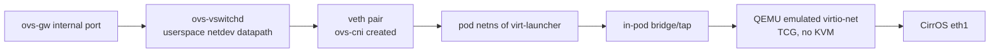
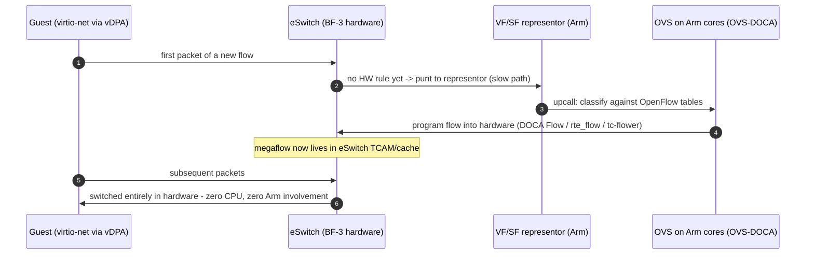

# From Software Datapath to BlueField-3 Hardware Offload: an Architectural Walkthrough

**Companion to:** `cluster_setup.sh` / `manifests.yaml` (the implemented software lab)
**Scope:** exactly what changes — layer by layer — when the implemented kind/KubeVirt/OVS datapath moves to an NVIDIA BlueField-3 DPU with vDPA and OVS hardware offload.

---

## 1. The datapath we actually built (baseline)

In the lab, a packet from the node's `ovs-gw` port to the CirrOS guest crosses these layers:

Every hop is CPU work. Three deliberate properties of the lab make the contrast with hardware offload sharp:

1. **Userspace (netdev) datapath.** We set `datapath_type=netdev`, so *every single packet* is processed by `ovs-vswitchd` in userspace. (Chosen so the lab runs on Docker Desktop for macOS, whose VM kernel may lack the `openvswitch` module.) The kernel (`system`) datapath would improve this to a per-flow model: first packet of a flow takes an upcall to userspace, the resulting *megaflow* is cached in the kernel, subsequent packets are switched in kernelspace. That upcall-then-cache lifecycle is the exact template hardware offload reuses — with the cache moved into silicon.
2. **veth + bridge binding.** The VM's eth1 reaches OVS through a veth pair created by ovs-cni plus in-pod plumbing by virt-launcher. Each crossing is a softirq/context-switch cost.
3. **Fully emulated virtio.** QEMU (TCG here; KVM+vhost in production software stacks) implements the virtio-net device: the "NIC" the guest sees is a software construct, and every descriptor is shuffled by CPU.

The verification artifacts show the model plainly: `ovs-ofctl dump-flows br1` reports the OpenFlow layer (a `NORMAL` L2-learning rule in our minimal setup), while the actual per-packet work happens in the datapath layer beneath it — the layer that hardware offload will subsume.

## 2. What a BlueField-3 changes physically

A BlueField-3 is not a NIC with helpers; it is a computer in front of the network: 16 Arm cores running Linux, a ConnectX-7-class eSwitch (embedded switch ASIC), and accelerators, sitting on the PCIe bus presenting *software-defined functions* to the host. Three architectural relocations follow.

**Control plane relocates to the DPU.** `ovs-vswitchd` and `ovsdb-server` stop running on the host (worker node) and run on the BlueField's Arm cores instead. The host never sees the switching logic — a security and isolation win (the "infrastructure vs. workload" separation OPI formalizes). In a Kubernetes context this is precisely why NVIDIA DPF exists: `DPUService`s deliver OVS/OVN components *onto the DPU cluster*, not onto the host.

**The switching fabric relocates to the eSwitch.** The NIC is flipped from "legacy" SR-IOV mode into **switchdev mode**. In switchdev, every VF (virtual function) or SF (scalable function) gets a **representor** netdev on the Arm side. Representors are the keystone abstraction: to OVS, a representor is just a port it adds to the bridge (exactly like our veths on `br1`), but semantically it is the *slow-path handle* for a hardware port. Traffic OVS sees on a representor is, by definition, traffic the hardware could not handle on its own.

**The virtio device relocates into hardware — this is vDPA.** vDPA (virtio data path acceleration) splits the virtio device: the **data path** (virtqueues, descriptor rings, DMA) is implemented by BlueField hardware, while the **control path** stays in software, mediated by the kernel's `vhost-vdpa` framework and the `mlx5_vdpa` driver. The guest still sees a plain virtio-net device — unmodified drivers, live-migration-friendly, no vendor lock-in inside the guest — but packets now DMA directly between guest memory and the eSwitch with no QEMU, no vhost worker thread, and no host CPU touching payloads. This is the crucial difference from classic SR-IOV VF passthrough, which achieves similar performance but exposes a vendor-specific device to the guest and breaks migration.

## 3. The offloaded flow lifecycle (what replaces what)

The per-flow lifecycle from the kernel datapath survives; each stage is reassigned:

Two offload implementations exist on BlueField, and it matters which one is named:

| | OVS-Kernel + TC offload | **OVS-DOCA** (current NVIDIA direction) |
|---|---|---|
| Slow path | kernel datapath on Arm | DPDK-style userspace datapath on Arm |
| HW programming API | `tc-flower` (`hw-offload=true`) | DOCA Flow (with rte_flow lineage) |
| Feature ceiling | what tc can express | full eSwitch: connection tracking, meters, mirroring, tunnels (VXLAN/Geneve) offloaded |
| Positioning | legacy/compat | the supported high-performance OVS on BF-3 |

In both, OVS remains OpenFlow-compatible — our `ovs-ofctl dump-flows` still works unchanged on the Arm side. What changes is where the *datapath* flows live: `ovs-appctl dpctl/dump-flows type=offloaded` shows rules resident in hardware, and a healthy system shows nearly all traffic there, with the representor path carrying only flow-miss packets.

## 4. The same lab, re-plumbed on BF-3

| Lab component (implemented) | BF-3 equivalent (conceptualized) |
|---|---|
| `br1`, `datapath_type=netdev`, on the node | `br-int`/`br1` in OVS-DOCA **on the DPU Arm cores**, ports = uplink + representors |
| veth pair from ovs-cni | **VF/SF + its representor**; the representor is the OVS port |
| ovs-cni allocating veths | SR-IOV/vDPA **device plugin** advertising VFs/SFs as node resources; NAD requests `nvidia.com/...` resource; CNI attaches the VF/SF to the pod/VM |
| QEMU-emulated virtio-net (TCG) | guest-visible virtio-net whose datapath is **hardware vDPA** (`mlx5_vdpa` + `vhost-vdpa`); KubeVirt requests it via the `vdpa`/SR-IOV interface path instead of `bridge:` binding |
| `ovs-gw` internal port ping test | same ping, but a correct verification adds: confirm the flow appears in `dpctl/dump-flows type=offloaded` and that representor byte counters stay ~flat while guest counters climb — proof packets bypass CPUs |
| Multus NAD `{"type":"ovs","bridge":"br1"}` | Multus NAD unchanged in spirit — the NAD/CRD layer is vendor-neutral; only the delegate CNI and resource annotations change |
| kind node = host + switch in one | host runs *only* workloads; DPU runs the network control plane (DPF `DPUService`s; in the OPI model, delivered through the vendor plugin path designed in Assignment 1) |

The Kubernetes-facing surface — NADs, `VirtualMachine` specs, the operator model — survives nearly intact, which is the entire point of the OPI/DPF layering: **the declarative intent stays constant while the datapath underneath is swapped from software constructs (veth, userspace OVS, emulated virtio) to hardware constructs (representors, eSwitch flow tables, vDPA virtqueues).**

## 5. What is gained, and what must be respected

Gained: line-rate switching with ~zero host CPU per packet; host-CPU cores returned to workloads; infrastructure/tenant isolation (a compromised host cannot inspect or reprogram the switch); offloaded connection tracking and tunneling; unmodified guests thanks to vDPA's virtio contract.

Respected: flows must be *offloadable* — actions outside eSwitch capability keep traffic on the Arm slow path, so flow design and verification (`dpctl/dump-flows type=offloaded` vs `type=ovs`) become an operational discipline; first-packet latency still exists (flow-miss punt); representor mis-plumbing is the dominant failure mode and is diagnosed exactly like our lab (ports on the bridge, flow dumps) — the tooling knowledge from the software lab transfers one-to-one.

## 6. Assumption log

Software lab uses emulation (no KVM in kind on macOS) and the netdev datapath (no kernel-module dependency); both choices affect only performance, not the OpenFlow/CNI semantics under study. BlueField-3 specifics (OVS-DOCA, switchdev, SF/VF representors, `mlx5_vdpa`) are described per NVIDIA's published DOCA/DPF architecture; no BF-3 hardware was available to this exercise, which is precisely why Task 5 is a conceptualization.
