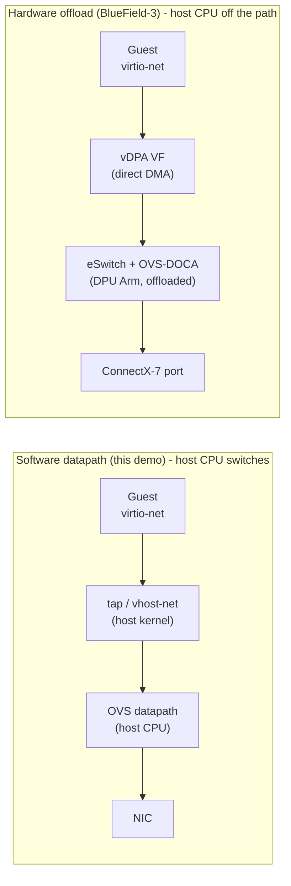

# From software OVS to hardware offload on NVIDIA BlueField-3

**Assignment 2, OPI Internship 2026 - Harsh Singh**

The rest of this submission builds a working-in-software datapath: a CirrOS VM whose
second interface lands on an Open vSwitch bridge, with another VM on the same bridge, and
ping traffic that OVS switches. This document is about what changes when you take that same
model and push the datapath down into an NVIDIA BlueField-3 DPU so the host CPU stops doing
the switching.

## 1. What the software demo actually does, and what it costs

In the demo, every frame a VM sends on the OVS network takes this path:

```
guest virtio-net  ->  tap (vhost-net, host kernel)  ->  OVS datapath on the host  ->  ... 
```

OVS runs on the node's CPUs. The first packet of a flow goes up to `ovs-vswitchd` (the slow
path), which installs a datapath rule; subsequent packets are handled by the kernel datapath.
That is completely fine for a lab and for control-plane-ish traffic, but the switching,
plus any encap/decap, VLAN work, or connection tracking, is paid for in host CPU cycles.
As you scale to real east-west traffic at 100G+, that "datapath tax" is exactly the cost you
want to get rid of. The point of a DPU is to move that work off the host entirely.

## 2. The BlueField-3 building blocks

Four pieces turn software OVS into a hardware-offloaded datapath. None of them changes the
tenant-facing intent (a VM with a secondary network); they change where the packets flow.

- **SR-IOV.** The BlueField-3 embedded ConnectX-7 exposes Virtual Functions (VFs). A VF can be
  handed to a VM, giving the guest a direct DMA path to the NIC instead of a host tap.
- **switchdev mode.** Put the NIC's embedded switch (eSwitch) in `switchdev` mode and each VF
  gets a *representor* netdev on the host/DPU. OVS is attached to the representors, so the OVS
  ports the demo used (`cirros-vm1-ovs`, `cirros-vm2-ovs`) become VF representors instead of
  taps.
- **Hardware offload.** With `other_config:hw-offload=true`, OVS pushes its datapath rules,
  through TC flower, into the eSwitch ASIC. The first packet of a flow still hits `ovs-vswitchd`
  to establish the rule; every packet after that is switched entirely in hardware and never
  touches a CPU. NVIDIA's **OVS-DOCA** is the newer path for this: the same OVS you already
  speak to, but programming the eSwitch through the DOCA Flow library, with higher rule scale
  and hardware offload of connection tracking, encap, and meters.
- **vDPA (virtio data path acceleration).** This is the key piece for VMs. vDPA keeps the guest
  on a *standard virtio-net driver* (control plane stays virtio, so the VM is portable and can
  live-migrate), while the ring data path is serviced directly by the BlueField VF hardware.
  Compared with full SR-IOV passthrough, vDPA keeps the virtio ABI so the guest needs no vendor
  driver and migration still works; compared with software virtio/vhost-net, it takes the host
  CPU out of the data path.

## 3. The two datapaths side by side



The shape is the same; the difference is that in the hardware case the guest still thinks it is
talking to a virtio device, but the frames are DMA'd to a VF and switched by the eSwitch under
OVS-DOCA control. On BlueField-3 in DPU mode, that OVS control plane runs on the DPU's own Arm
cores, so even the slow path is off the host - the host does not have to run, or be trusted
with, the networking stack at all.

## 4. Mapping the demo's Kubernetes objects forward

The nice property is that the Kubernetes model barely changes; the plumbing underneath the
same intent is swapped:

| Demo (software) | BlueField-3 (offloaded) |
|---|---|
| OVS bridge `br1` on the node, `fail-mode=standalone` | eSwitch in `switchdev`, OVS/OVS-DOCA on the DPU with `hw-offload=true` |
| `NetworkAttachmentDefinition` type `ovs`, tap into `br1` | NAD that allocates a VF/vDPA device and a representor into the offloaded bridge |
| OVS-CNI attaches a tap | a VF/vDPA-capable CNI (SR-IOV/accelerated-bridge, or OVS-CNI in hardware-offload mode) |
| KubeVirt interface `bridge: {}` | KubeVirt interface `sriov: {}` / a vDPA-backed device |
| VF exposed to the scheduler | `sriov-network-device-plugin` advertises a vDPA resource pool |

Concretely, the transition is:

1. Flip the NIC to switchdev and create VFs (`devlink dev eswitch set ... mode switchdev`).
2. Turn on OVS hardware offload (`hw-offload=true`) or deploy OVS-DOCA.
3. Swap OVS-CNI's plain-bridge attachment for a VF/vDPA attachment, and advertise the VFs with
   the SR-IOV device plugin so the scheduler can place VMs that request them.
4. Change the KubeVirt VM interface from `bridge` to an SR-IOV/vDPA binding; the guest keeps its
   virtio-net driver.

At that point a `ping` between the two VMs produces the same result as the demo, but after the
first packet the ICMP frames are switched inside the ConnectX-7 eSwitch and the host CPU sees
none of them. The `ovs-ofctl dump-flows` that this submission captures in software would, on the
DPU, additionally show those flows marked offloaded (for example `used`/`offloaded:yes` in the
datapath flow dump), which is the observable proof that the datapath moved into hardware.

## 5. How this connects to OPI / DPF

This is the same hardware story the OPI DPU Operator and NVIDIA's DPF are built around. DPF
provisions the BlueField (flashes it, joins it to a cluster) and can run OVS-DOCA on the DPU as
a managed service, and its `ServiceChain` / `ServiceInterface` resources are the declarative way
to express exactly the kind of L2 path this demo wired by hand. So the software demo here and
the hardware target are two ends of one road: the CNI + KubeVirt model is how you prove the wiring
locally, and BlueField-3 + vDPA + OVS-DOCA (orchestrated by DPF) is how you run it at line rate
without spending host CPU.

## 6. Honest caveats

- vDPA live migration works because the control plane stays virtio, but it needs matching
  device/feature support on source and destination; it is not automatic.
- Hardware offload has a first-packet slow path and finite rule capacity in the eSwitch; very
  high flow-churn or unsupported actions fall back to software, so offload coverage is a real
  design metric, not a given.
- switchdev, the right VF count, and OVS-DOCA versus TC-flower are host/DPU configuration
  decisions that depend on the BlueField firmware and DOCA version in use, which is why this
  document stays at the architecture level rather than pinning exact commands.
