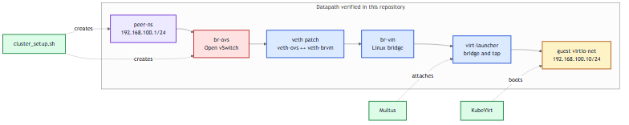
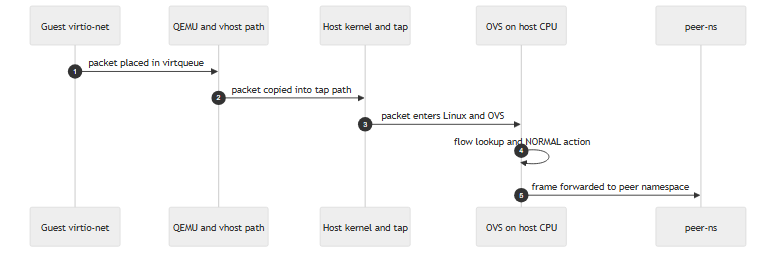
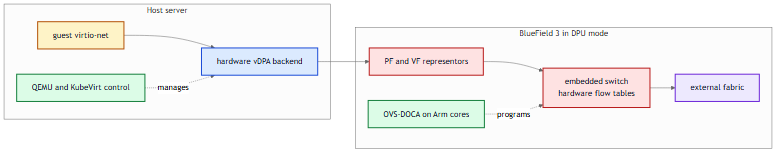
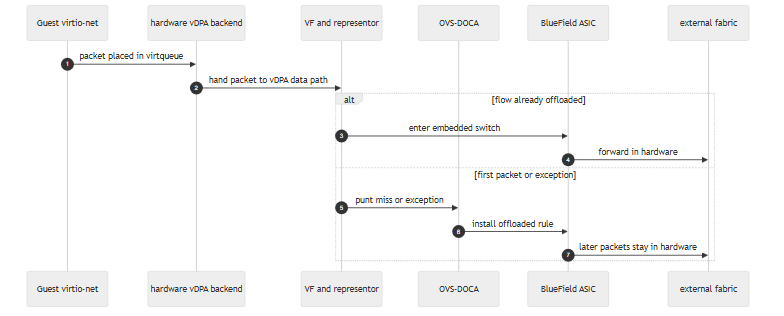

# From Software OVS To BlueField 3 Offload:

**Author:** Mridankan Mandal.

This documentation explains how the datapath implemented in this repository would change on an NVIDIA BlueField 3 system using `vDPA`, `switchdev`, and `OVS-DOCA`. The software path described below is the one implemented and verified in this work. The BlueField 3 path is the corresponding hardware design based on NVIDIA and Linux kernel documentation [4][5][6][7].

## 1. Software Datapath In This Lab:

The VM is attached to a secondary network through `Multus`. That attachment lands on `br-vm`, which is connected to `br-ovs` through a veth pair. Traffic is verified against a peer namespace at `192.168.100.1/24`.

Packet path:

`peer-ns -> br-ovs -> veth patch -> br-vm -> virt-launcher bridge and tap -> guest virtio-net`

## Figure 1:

Figure 1. Implemented software datapath overview. The guest reaches Open vSwitch through Linux bridge and veth plumbing. Open vSwitch is present as a software switching point on the host.

## 2. Software Packet Walk:

When the guest sends a packet on the OVS backed interface, the packet crosses the virtio queue, QEMU path, host kernel, and OVS software lookup path before it leaves the node. In other words, the host CPU remains in the forwarding path.

## Figure 2:

Figure 2. Software packet walk. The packet is produced by the guest, enters the host software path, is matched by OVS, and is then forwarded to the peer namespace.

This has three immediate consequences:

- The host CPU does forwarding work as well as guest compute work.
- Packet processing competes with tenant workload execution.
- OVS state is easy to inspect because forwarding still happens in software.

## 3. What Changes On BlueField 3:

The control plane intent remains similar. `Multus` still describes an extra network attachment. `KubeVirt` still manages the VM lifecycle. The main change is the forwarding substrate.

In the current work, the guest reaches OVS through Linux bridge and veth plumbing. On BlueField 3 in DPU mode, that path is replaced by PF and VF representors connected to the embedded switch [5]. Linux `switchdev` provides the kernel model for this kind of hardware switching path [7]. NVIDIA documents the BlueField `vDPA` path on top of this model [6].

## Figure 3:

Figure 3. BlueField 3 offload architecture. The host still runs the VM and its control plane. Forwarding moves into the BlueField device, where `OVS-DOCA` programs the embedded switch [4][5].

The main substitutions are:

- `br-vm` plus veth patching become representor based attachment.
- Host OVS software forwarding becomes hardware flow steering on the BlueField embedded switch.
- Guest virtio networking is preserved, but the backend moves to a hardware `vDPA` path [6].

## 4. Why vDPA Matters Here:

The assignment asks about BlueField 3 with `vDPA` and hardware offload. That is a useful comparison because `vDPA` keeps the guest side virtio model intact while moving the data path toward hardware [6]. The guest still sees a familiar network device, but the steady state forwarding path no longer depends on host OVS software processing.

## 5. Packet Handling On BlueField 3:

The offloaded path is different from the software path in one important way. The first packet of a flow and later packets are not handled in the same place.

- A miss or exception can still reach the control plane.
- `OVS-DOCA` programs the hardware rule.
- Once the rule is installed, later packets stay in the BlueField fast path [4][6].

## Figure 4:

Figure 4. BlueField 3 `vDPA` packet walk. Misses can still involve the control plane. Stable flows are forwarded in hardware.

## 6. What Must Be Verified On Real Hardware:

The software lab proves the baseline path. A real BlueField 3 validation would need stronger checks:

- `switchdev` is enabled on the relevant interfaces [6][7].
- PF and VF representors exist and are used for the VM path [5].
- OVS rules are not only installed, but actually offloaded [4].
- Hardware counters advance under traffic.
- Host CPU cost drops relative to the software baseline.

## 7. Summary:

The software datapath in this work is:

`guest -> QEMU and tap -> host kernel -> OVS software path -> external peer`

The BlueField 3 `vDPA` design changes that to:

`guest -> hardware vDPA backend -> VF or representor path -> BlueField embedded switch -> external fabric`

What stays the same is the orchestration intent. What changes is where forwarding happens. The host stops doing per packet software switching, and the BlueField device takes over the fast path [4][5][6].

## References:

1. KubeVirt User Guide, Interfaces and Networks. https://kubevirt.io/user-guide/network/interfaces_and_networks/.
2. KubeVirt User Guide, Network Binding Plugins. https://kubevirt.io/user-guide/network/network_binding_plugins/.
3. KubeVirt User Guide, Live Migration. https://kubevirt.io/user-guide/compute/live_migration/.
4. NVIDIA DOCA Documentation, OpenvSwitch Acceleration - OVS in DOCA. https://docs.nvidia.com/doca/sdk/openvswitch%2Bacceleration%2B-%2Bovs%2Bin%2Bdoca/index.html.
5. NVIDIA DOCA Documentation, DPU Kernel Representors Model. https://docs.nvidia.com/doca/sdk/dpu%2Bkernel%2Brepresentors%2Bmodel/index.html.
6. NVIDIA DOCA Documentation, Virtio Acceleration through Hardware vDPA. https://docs.nvidia.com/doca/sdk/Virtio-Acceleration-through-Hardware-vDPA/index.html.
7. Linux Kernel Documentation, Switchdev. https://www.kernel.org/doc/html/latest/networking/switchdev.html.
