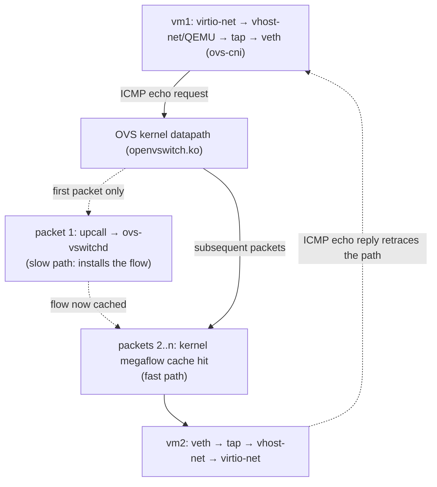
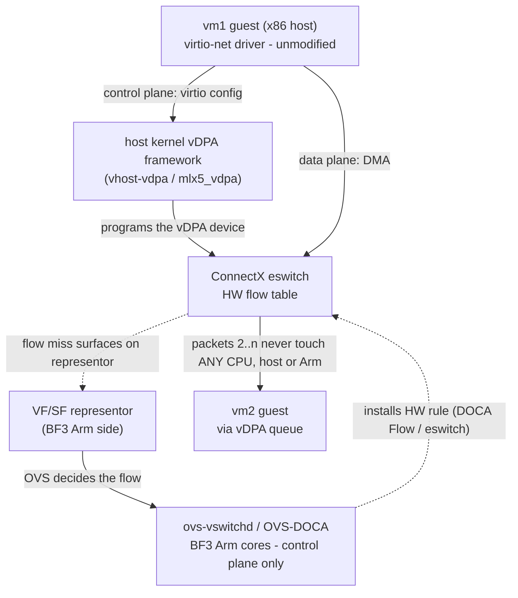

# From Software OVS to a BlueField-3 Hardware Datapath

How the datapath built in this assignment - KubeVirt VMs on an OVS bridge inside a
kind node - changes when the same architecture is moved onto an NVIDIA
BlueField-3 (BF3) DPU with vDPA and full hardware offload.

## Summary (the one-line answer)

**The VM does not change; the packet-forwarder does.** Today, every packet is
switched by OVS *software running on the host CPU*. On a BlueField-3, the exact
same OVS match-action logic is executed by the DPU's *NIC hardware (eswitch)* -
so packets 2..n of a flow never touch a CPU at all. Three technologies make
this transparent: **switchdev mode** (exposes hardware ports OVS can program),
**hardware offload via TC-flower / OVS-DOCA** (pushes the flow rules into
silicon), and **vDPA** (keeps the guest on plain virtio while the NIC does the
data plane). The Kubernetes contract - the NetworkAttachmentDefinition, the
KubeVirt VM, the OVS northbound - stays the same; only *who forwards the
packet* moves from the host kernel to the NIC.

---

Everything below is grounded in what this repo actually deployed: two CirrOS
VMs with pinned MACs (`02:00:00:00:00:01/02`) on OVS bridge `br1`, a single
`actions=NORMAL` OpenFlow rule, and the kernel-datapath megaflows we captured
in `evidence/dpctl_microflows.txt`.

---

## 1. The packet walk today (software, as implemented here)

A single ICMP echo from vm1 → vm2 in this repo's setup traverses:



Every packet costs host CPU: guest↔host memory copies at the vhost boundary,
softirq processing, and the OVS kernel-datapath lookup. The first packet of
each flow additionally takes the userspace upcall round-trip.

We can see this two-tier design directly in our evidence:

* `verification_flows.json` - the *OpenFlow* table (`ovs-vswitchd`, slow
  path): one `priority=0 actions=NORMAL` rule whose `n_packets` counter grows
  with every ping run (the gate requires a delta ≥ 40 for 20 echo/reply pairs).
* `evidence/dpctl_microflows.txt` - the *kernel datapath* cache (fast path):
  bidirectional megaflows keyed on
  `eth(src=02:00:00:00:00:01,dst=02:00:00:00:00:02), eth_type(0x0800)` whose
  packet count runs one or two short of the echos sent - the first packets
  went to userspace before the megaflow was installed; the miss is visible
  right in the counters.
* The megaflows wildcard L3+ (`ipv4(src=0.0.0.0/0.0.0.0,…)`) because a NORMAL
  L2 pipeline only needs MAC/EtherType to decide the output port. OVS inserts
  the *widest match that preserves the pipeline's decision* - fewer, wider
  cache entries. **This match-action megaflow is precisely the unit a DPU
  offloads to hardware**, which is why the concept transfers so directly.

## 2. What Changes on a BlueField-3: Hardware-Offloaded Datapath

The architectural move: take the two-tier "slow path installs flows, fast path
forwards" split we just observed, and push the fast path out of the host
kernel into the NIC's embedded switch (eswitch) - with the slow path
(ovs-vswitchd) relocated onto the DPU's Arm cores.



Three technologies make this work:

### 2.1 switchdev mode and representors

The ConnectX NIC in the BF3 is put into **eswitch switchdev mode** (versus
legacy SR-IOV mode). Every virtual function (VF) or scalable function (SF)
handed to a VM gets a **representor netdev** on the Arm side. The representor
is the control-plane twin of the VM's interface:

* Packets with no matching hardware flow arrive *on the representor* - the
  eswitch's equivalent of the kernel-datapath upcall.
* Whatever the representor is plugged into (here: an OVS bridge) decides the
  fate of the flow, and that decision is pushed down as a hardware rule.

In this repo, the veth pair created by ovs-cni plays the structural role of
the representor: the bridge-side port that stands in for the VM. The
difference is that a veth *carries every packet*, while a representor carries
*only flow misses*.

### 2.2 Flow offload: TC flower → OVS-DOCA

Two generations of offload API:

* **Kernel OVS + TC flower** (what `ovs-vswitchd` does on any switchdev NIC,
  including BF3): instead of installing megaflows only into `openvswitch.ko`,
  vswitchd mirrors them into TC `flower` classifier rules on the representor;
  the mlx5 driver translates TC rules into eswitch entries. Enabled with two
  commands:

  ```bash
  devlink dev eswitch set pci/<nic> mode switchdev
  ovs-vsctl set Open_vSwitch . other_config:hw-offload=true
  ```

  Verification: `ovs-appctl dpctl/dump-flows` then shows `offloaded:yes, dp:tc`.
* **OVS-DOCA** (NVIDIA's OVS build on the BF3 Arm cores): replaces the kernel
  datapath with a DOCA-Flow-based one, programming eswitch hardware directly.
  Same OpenFlow/OVSDB northbound (our `manifests.yaml` NAD would not care),
  but higher insertion rates, larger flow tables, and access to BF3-only
  actions (connection tracking, meters, encap/decap at line rate).

Either way, the megaflow we captured -
`eth(src=02:00:00:00:00:01,dst=02:00:00:00:00:02) → output:port` - becomes a
hardware match-action entry, and the packet counters we read with
`dpctl/dump-flows` would be read back *from eswitch hardware counters*.

### 2.3 vDPA: hardware virtio without giving up virtio

vDPA (virtio data path acceleration) splits the virtio device:

* **Data plane**: the NIC implements virtio ring processing in hardware; DMA
  goes directly guest-memory ↔ NIC. No vhost-net copies, no QEMU in the path.
* **Control plane**: stays in software (`vhost-vdpa` kernel framework), so the
  guest still sees a *standard virtio-net PCI device*.

Comparison with the alternatives:

| | virtio + vhost-net (this repo) | SR-IOV VF passthrough | **vDPA on BF3** |
|---|---|---|---|
| Guest driver | virtio-net (generic) | mlx5 (vendor) | virtio-net (generic) |
| Data path | host kernel copies | hardware DMA | hardware DMA |
| Host CPU per packet | high | ~zero | ~zero |
| Live migration | yes | painful (vendor-specific) | yes (virtio state is standard) |
| Guest image portability | any | needs vendor driver | any |
| Performance | lowest | line rate | ~line rate |

vDPA is the reason the "move to hardware" is transparent to this repo's
`manifests.yaml`: the KubeVirt VM keeps a virtio interface; only the thing
*backing* it changes.

## 3. Component mapping: this repo → BF3 deployment

| This repo (software) | BlueField-3 equivalent |
|---|---|
| kind node (Docker container) | x86 hypervisor host with BF3 installed |
| `br1`, kernel OVS datapath | OVS-DOCA bridge on BF3 Arm cores + eswitch HW flow table |
| `ovs-vswitchd` in the node | `ovs-vswitchd` on BF3 Arm cores (host x86 runs *no* vswitch at all) |
| veth pair from ovs-cni | VF/SF **representor** port |
| virtio-net + vhost-net (QEMU) | virtio-net + **vDPA** (hardware data plane) |
| kernel megaflow (`dpctl/dump-flows`) | eswitch flow entry (`offloaded:yes, dp:tc` / DOCA counters) |
| userspace upcall on first packet | representor miss → OVS on Arm → HW rule insertion |
| Multus + ovs-cni NAD | SR-IOV/vDPA device plugin + NAD (e.g. `vdpa` mode in the SR-IOV network operator), or OVN-Kubernetes accelerated by the DPU |
| OVS access port `tag=100` (our `ovs-net-vlan100` NAD) | eswitch VLAN push/pop, executed by NIC hardware - the tag never costs a CPU cycle |
| `ovs-cni.network.kubevirt.io/br1` node resource | `nvidia.com/…` VF/SF resource advertised by the device plugin |

The Kubernetes-facing shape survives: a NetworkAttachmentDefinition still
selects the secondary network, KubeVirt still requests an interface, and the
scheduler still places VMs by node resource. What changes is *who forwards
packets*: the host kernel exits the picture entirely.

## 4. How offload is verified (the datapath evidence, hardware edition)

The verification methodology in `cluster_setup.sh` translates one-to-one:

| Software check (this repo) | Hardware check (BF3) |
|---|---|
| `ovs-ofctl dump-flows br1` counters delta | same command, same bridge - northbound unchanged |
| `ovs-appctl dpctl/dump-flows -m` shows the MAC-keyed megaflow with its packet count | same dump shows `offloaded:yes, dp:tc` (kernel+TC) or DOCA pipe counters; software counter stays ~1 (only the first packet) |
| `fdb/show` has both VM MACs | unchanged (MAC learning still in OVS) |
| ping 0% loss over `br1`-only subnet | unchanged |
| - | `ethtool -S <representor>` / port counters showing traffic bypassing the Arm datapath |
| - | `tc -s filter show dev <representor> ingress` showing `in_hw` rules with hardware hit counters |

The tell-tale signature of working offload: **the ping succeeds while the
software datapath counters stop incrementing** - packets 2..n exist only in
hardware counters.

## 5. Trade-offs: what you gain, what you pay

Offload is not free - the honest engineering ledger:

| You gain | You pay |
|---|---|
| Host CPU leaves the packet path entirely (cores go back to workloads) | A second computer to operate: the DPU runs its own OS, needs its own lifecycle, upgrades, monitoring |
| Line-rate switching, VLAN push/pop, encap, conntrack in silicon | Finite eswitch rule capacity - high flow churn or huge flow counts overflow to the slow path |
| Guest stays on plain virtio (portable, live-migratable) via vDPA | Deeper vendor coupling on the *infrastructure* side (DOCA, mlx5, firmware matrices) |
| Stronger isolation: host can be untrusted, network policy lives on the DPU | Harder debugging - packets you could `tcpdump` on a veth (as this repo does) are now invisible inside the ASIC; you debug via counters and representor mirrors |
| Same OpenFlow/OVSDB northbound - controllers don't change | First packet of every flow still takes the slow path; flow-setup rate becomes the new bottleneck |
| Lower and more predictable latency/jitter | Real money: DPUs, and the rack power/cooling budget for them |

The practical rule: offload pays off when east-west traffic volume is high
and flows are long-lived (the megaflow hit rate is high) - exactly the
pattern our 20-echo ping demonstrated in miniature, where all but the first
packets rode the cached fast path.

## 6. Honest caveats

Before going further, the limits of what this repo actually demonstrates:

* **Nothing in this repo is hardware-offloaded.** kind + veth + kernel OVS is
  a faithful *model* of the control-plane relationships, not of performance.
  veth interfaces have no eswitch; TC flower offload is meaningless on them.
* **Not every flow offloads.** Actions the eswitch can't express (some
  connection-tracking states, uncommon encaps, packets requiring the OVS
  `NORMAL` MAC-learning action itself) fall back to the Arm-side slow path.
  Real deployments measure the *offload hit rate*, not just correctness. Our
  single NORMAL rule is the simplest case: learned unicast L2 forwarding,
  which offloads cleanly once MAC learning has happened.
* **The first packet is always software.** The megaflow-vs-echo counter gap we
  measured in the kernel cache exists on BF3 too - flow-miss latency and
  insertion rate become the scaling bottleneck (this is OVS-DOCA's main
  advantage over TC-based offload).
* **CirrOS/QEMU specifics don't carry over**: cloud-init-over-serial and
  containerdisk images are development conveniences; a production BF3 stack
  provisions VMs with real images and the DPU with its own OS (DOCA BFB).

## 7. Going further: operational concerns

Raw forwarding is only half the story. Three operational questions decide
whether this architecture is actually deployable - migration, failure
behaviour, and scaling past a single node.

### 7.1 Live migration with vDPA (Track 1)

vDPA keeps VMs live-migratable *because the guest sees a standard virtio-net
device* - the virtio ABI is the migration contract. The guest's driver, ring
layout, and feature negotiation are hardware-independent, so its saved state is
meaningful on any destination - in principle even a different NIC vendor,
provided the destination supports the negotiated feature set. What must line up
on source and destination:

* **Negotiated virtio feature bits** must be a compatible set (checksum, mrg
  rxbuf, multiqueue, etc.) - the destination vDPA device must support at least
  what the guest negotiated.
* **Queue state** (ring indices, in-flight descriptors) is transferred as part
  of the standard virtio device state via the `vhost-vdpa` framework (via shadow
  virtqueues in QEMU where the device lacks native dirty-tracking).
* **OVS/eswitch flow rules** are re-installed on the destination by its own
  ovs-vswitchd once the VM's representor appears - flows don't migrate; the
  control plane rebuilds them (first-packet slow path again on the new node).

Contrast with **SR-IOV VF passthrough**: the guest binds the vendor `mlx5`
driver directly to the VF, so its state is tied to that specific hardware.
Migration means detaching the VF, hot-unplugging a vendor device from a live
guest, and hoping the destination has an identical NIC - fragile and often
requiring a guest-visible bond/failover interface. vDPA removes that coupling
entirely: same virtio device before and after, hardware swapped underneath.

### 7.2 Failure domains

Migration assumes both nodes are healthy; the next question is what happens when
they are not. Pushing the datapath onto the DPU splits the failure model in a
useful way:

* **DPU / Arm control plane crashes** (ovs-vswitchd or the Arm OS dies): already
  *installed* eswitch rules keep forwarding in hardware (until entries age out) -
  existing flows do not drop. What stops is **new flow setup**: a flow miss has no one to service it,
  so genuinely new connections stall until the control plane recovers. The data
  plane degrades gracefully rather than going dark.
* **Host (x86) compromise or crash**: the network policy lives on the DPU, not
  the host, so a compromised host cannot rewrite eswitch rules or bypass the
  policy enforced below it - the DPU is a separate trust domain with its own OS.
  A host crash takes its guests down (as always), but does not corrupt the DPU's
  forwarding state for other tenants.

This is the security story behind "host can be untrusted" in §5: the blast
radius of each side is bounded, and the most disruptive failure (control-plane
loss) still preserves in-flight traffic.

### 7.3 Multi-node fabric (beyond this single-node demo)

Migration and failure domains both assumed more than one node; this is how the
datapath spans them. This repo is single-node: all forwarding is local L2 on one
`br1`. Across nodes,
the standard pattern is an **overlay** - VXLAN or Geneve tunnels between hosts -
and on a BF3 the **encap/decap happens in eswitch hardware**: the tunnel header
is pushed/popped by the NIC, so the host CPU never sees per-packet tunnelling
cost. The OVS model is unchanged (a tunnel port + flow actions), but the
expensive part moves to silicon - the multi-node extension of exactly the
single-node offload shown here.

## 8. OPI / DPF tie-in

This assignment's stack is the software twin of what the Open Programmable
Infrastructure (OPI) project standardizes for real DPUs:

* **OPI** defines vendor-neutral APIs (network, storage, security, lifecycle)
  so a K8s cluster can consume "a DPU-backed interface" the way this repo
  consumes an ovs-cni interface - without NVIDIA-specific glue.
* The **OPI dpu-operator** makes that concrete in Kubernetes with CRDs: a
  `DataProcessingUnit` represents the discovered DPU,
  `DataProcessingUnitConfig`/`DpuOperatorConfig` configure it, and a
  `ServiceFunctionChain` declares the packet path through it - the
  declarative equivalent of the bridge-and-ports wiring this repo's
  `manifests.yaml` + OVS-CNI express. A vendor plugin (NVIDIA, Intel, Marvell)
  translates those CRs into device-specific programming.
* **NVIDIA DPF (DOCA Platform Framework)** is NVIDIA's operator suite for
  BF3 fleets: it installs the DPU OS (BFB), deploys OVS-DOCA/HBN service
  chains onto the Arm cores, and wires device plugins so pods/VMs land on
  offloaded interfaces - the productionized version of what
  `cluster_setup.sh` does here with a daemonset and a bash loop.

The through-line: the OpenFlow/OVSDB model, the NAD/device-plugin contract,
and the megaflow match-action unit are all preserved; only the executor of
the fast path moves - from `openvswitch.ko` on the host CPU, to an eswitch
the host never sees.

## 9. References

* OVS hardware offload (`hw-offload`, TC flower datapath) -
  "Flow Hardware offload with Linux TC flower":
  <https://docs.openvswitch.org/en/latest/howto/tc-offload/>
* NVIDIA DOCA SDK (OVS-DOCA / DOCA Flow):
  <https://networking-docs.nvidia.com/doca/sdk>
* Linux kernel switchdev model -
  "Ethernet switch device driver model (switchdev)":
  <https://docs.kernel.org/networking/switchdev.html>
* Linux vDPA / VDUSE ("vDPA Device in Userspace"):
  <https://docs.kernel.org/userspace-api/vduse.html>
* OPI dpu-operator: <https://github.com/opiproject/dpu-operator>
* NVIDIA DOCA Platform Framework (DPF):
  <https://networking-docs.nvidia.com/dpf/25101>
* KubeVirt: <https://kubevirt.io/> · Multus:
  <https://github.com/k8snetworkplumbingwg/multus-cni> · OVS-CNI:
  <https://github.com/k8snetworkplumbingwg/ovs-cni>
